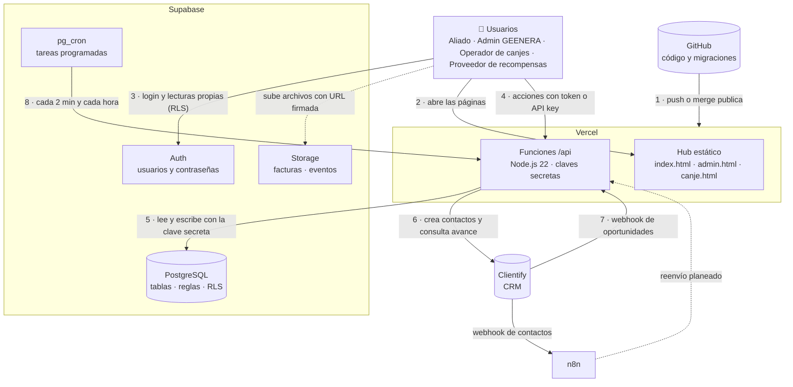
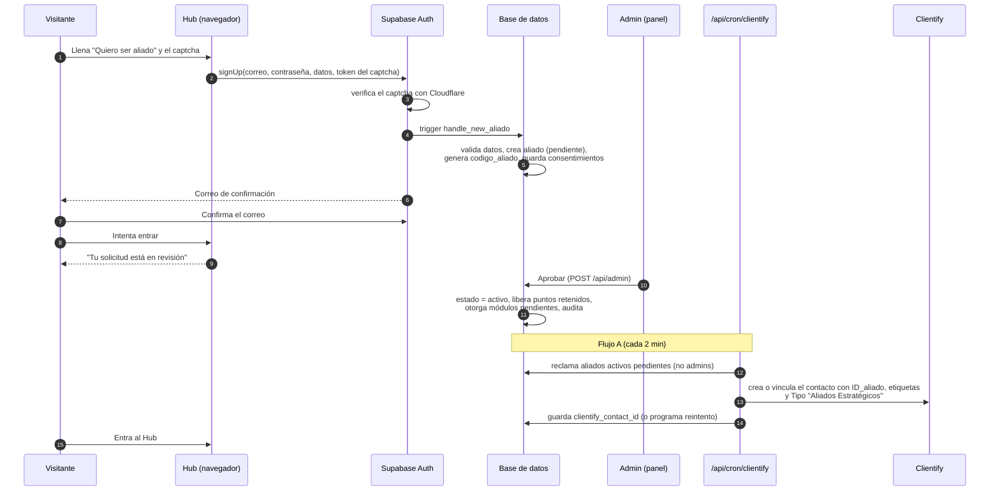
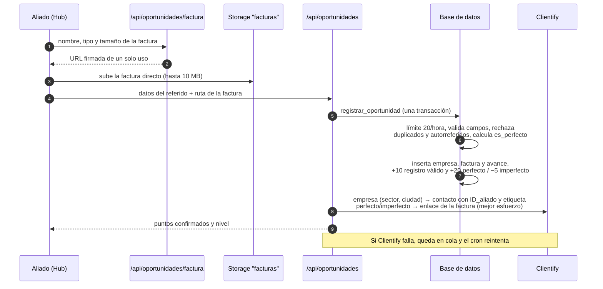
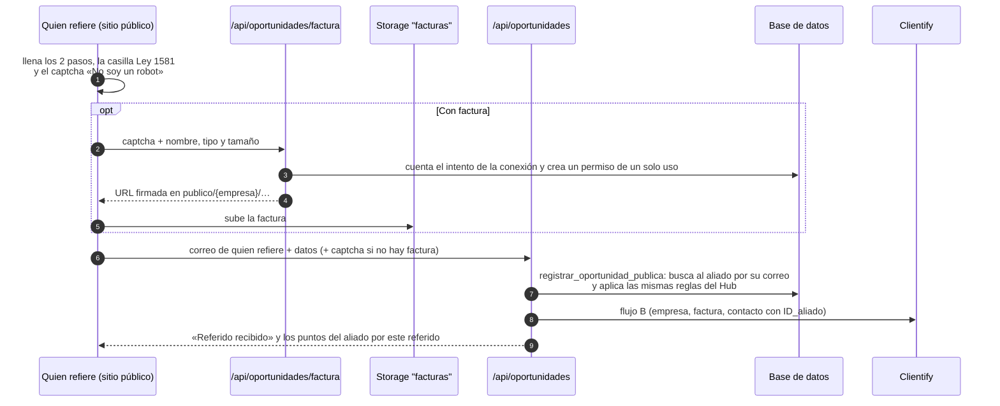
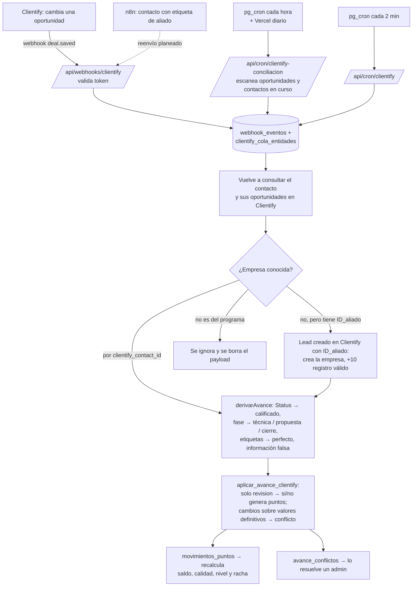
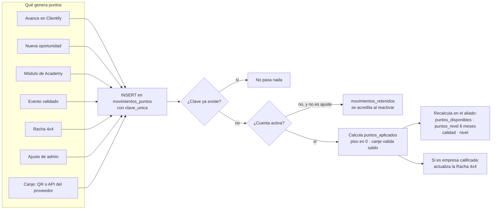
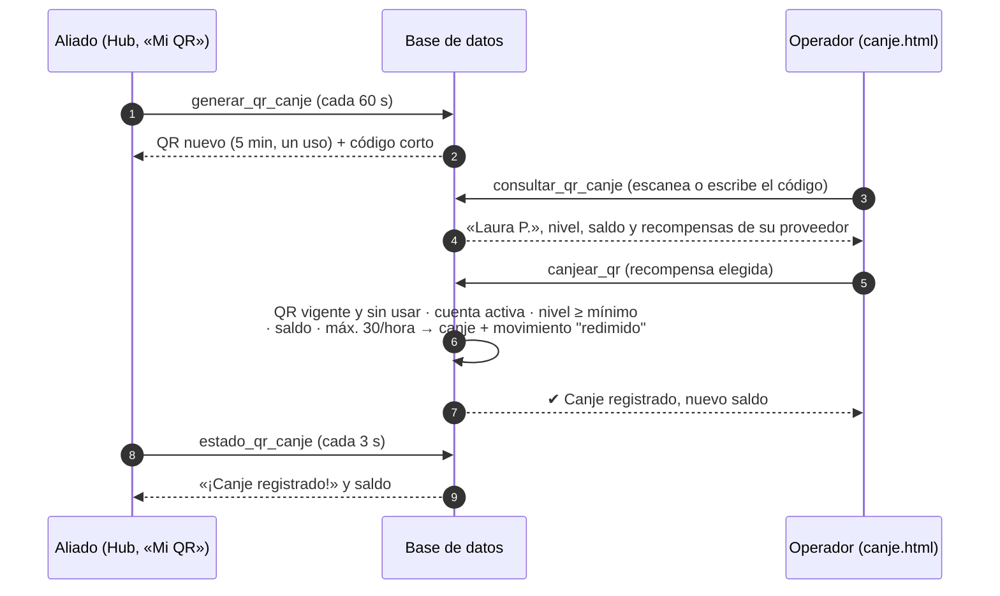
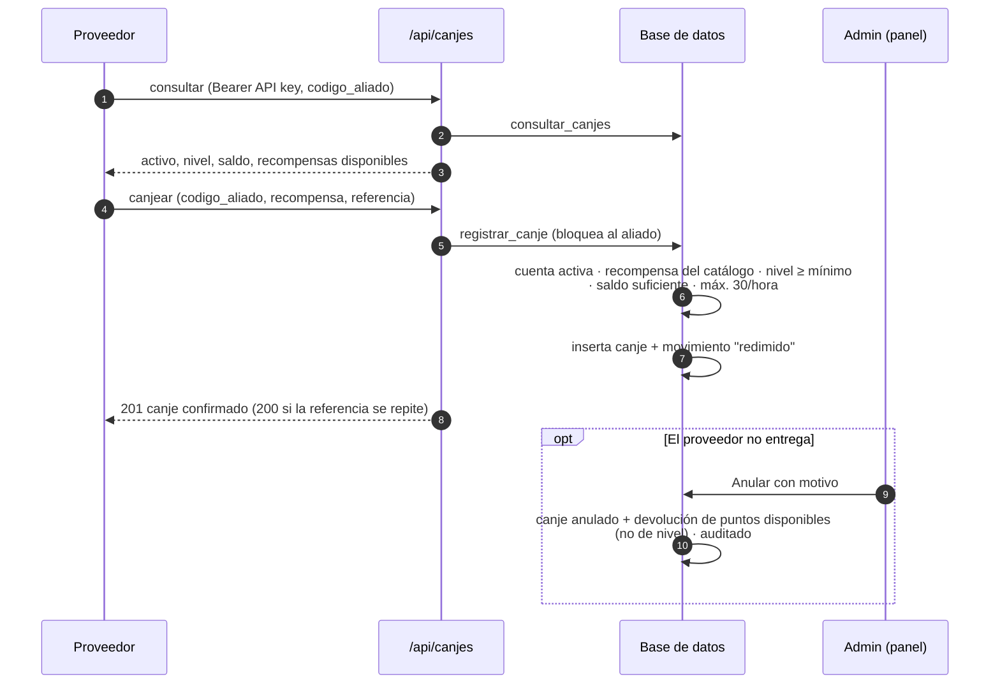
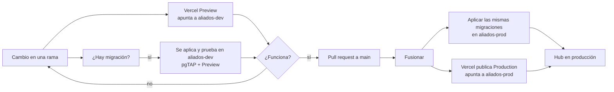
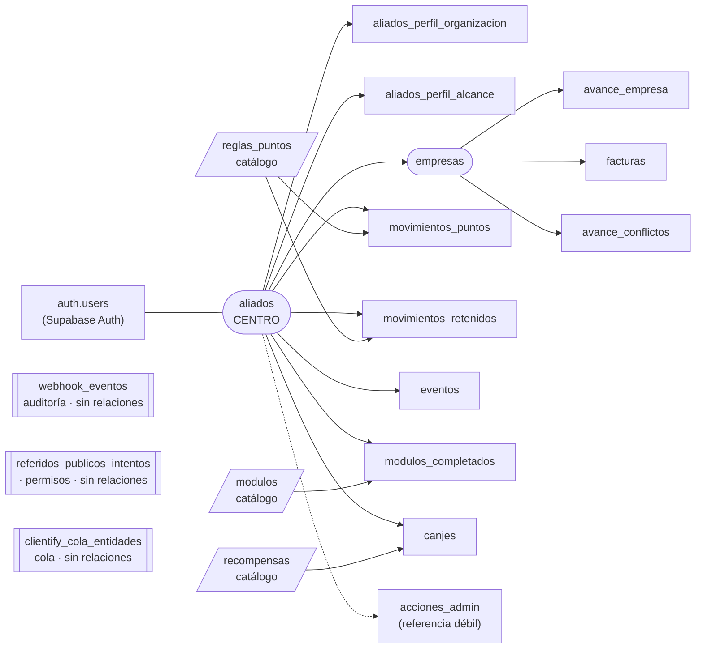

# Guía integral del Aliados del Sol Hub

> **Para qué sirve este documento.** Reúne en un solo lugar cómo funciona el Hub, por qué se construyó así, las decisiones del equipo, el modelo de datos y los pasos para ponerlo en producción. Si se pierde una conversación con Claude, este archivo y `CLAUDE.md` bastan para retomar el trabajo.
>
> **Fecha de corte:** 5 de octubre de 2026. **Estado:** fases 1 a 11 construidas, con pruebas automáticas en el entorno de pruebas (`aliados-dev`). La fase 11 (canje con código QR, §5.6) además pasó la prueba real con celulares Android e iPhone. El correo propio de las cuentas (§5.9) está configurado y probado en `aliados-dev`. Las correcciones previas a las pruebas de aceptación (rama `correcciones-hub`: Tipo «Aliados Estratégicos» en Clientify, formulario público propio, celular único, Hub ajustado al celular y captcha en registro y logins) están hechas y probadas en el Preview. La prueba de aceptación con Clientify real ya verificó los flujos A, B y C (referidos, calificación, fases de la oportunidad, penalizaciones y conflictos); los casos que faltan están marcados en §10.1. Producción (`aliados-prod`) aún no tiene el esquema ni recibe aliados.
>
> **Documentos relacionados:** `CLAUDE.md` (contexto técnico permanente, más detallado en reglas e implementación), `docs/HANDOFF.md` y `docs/DESIGN_SYSTEM.md` (diseño del Hub).

---

## Contenido

1. [Qué es el Hub, en una página](#1-qué-es-el-hub-en-una-página)
2. [Las plataformas y qué hace cada una](#2-las-plataformas-y-qué-hace-cada-una)
3. [Preguntas de infraestructura](#3-preguntas-de-infraestructura)
4. [Planes gratuitos y de pago: ¿hace falta Pro?](#4-planes-gratuitos-y-de-pago-hace-falta-pro)
5. [Flujos de trabajo (diagramas)](#5-flujos-de-trabajo-diagramas)
6. [Reglas del programa: puntos, calidad, niveles](#6-reglas-del-programa-puntos-calidad-niveles)
7. [Modelo de datos: tablas y columnas](#7-modelo-de-datos-tablas-y-columnas)
8. [Seguridad y variables de entorno](#8-seguridad-y-variables-de-entorno)
9. [Decisiones tomadas](#9-decisiones-tomadas)
10. [Del entorno de pruebas a producción: tres etapas](#10-del-entorno-de-pruebas-a-producción-tres-etapas)
11. [Pendientes y preguntas abiertas](#11-pendientes-y-preguntas-abiertas)
12. [Glosario](#12-glosario)

---

## 1. Qué es el Hub, en una página

**Aliados del Sol Hub** es la plataforma del programa de referidos de GEENERA. Personas y organizaciones (los **aliados**) refieren empresas que podrían instalar energía solar. Por cada avance real de esas empresas en el proceso comercial ganan **Puntos Sol**, suben de **nivel** y pueden **canjear recompensas**.

Lo que puede hacer cada persona hoy:

| Quién | Qué hace en el Hub |
|---|---|
| **Visitante** | Ve el sitio público y solicita ser aliado. Puede referir una empresa en el formulario público **escribiendo el correo de un aliado**: la empresa queda en el Hub de ese aliado (§5.2). |
| **Aliado pendiente** | Se registró y confirmó su correo, pero espera la aprobación de GEENERA. No entra al Hub. |
| **Aliado activo** | Entra al Hub: registra oportunidades ("Nueva oportunidad") con factura, sigue el avance de sus referidos, ve su historial de puntos, su nivel, su Racha Solar, hace cursos en la Academy, reporta eventos, **muestra su QR para canjear** y ve sus canjes. |
| **Admin (equipo GEENERA)** | Usa el panel `admin.html`: aprueba o rechaza solicitudes, suspende o reactiva cuentas, ajusta puntos, valida eventos, resuelve conflictos con Clientify, administra el catálogo de recompensas, **invita operadores** y anula canjes. También puede escanear QR. Todo queda auditado. |
| **Operador de canjes** (personal de GEENERA o del proveedor) | Entra a `canje.html` desde su celular, escanea el QR del aliado, elige la recompensa y confirma. No es aliado: lo invita un admin. |
| **Proveedor de recompensas** (sistema externo) | Consulta el saldo de un aliado por su código y registra canjes con su API key. |

**Tres ideas que explican casi todo el diseño:**

1. **Cada sistema es dueño de su información.** Supabase es dueño de los puntos y los aliados; Clientify es dueño del proceso comercial; Vercel solo muestra la interfaz y conecta los dos.
2. **Los puntos se escriben en un libro mayor que solo acepta inserciones.** Nunca se edita un saldo a mano: se registran movimientos y la base recalcula todo. Eso da trazabilidad y evita puntos duplicados.
3. **El navegador nunca habla con Clientify ni ve las claves secretas.** Todo lo sensible ocurre en funciones de servidor (`/api`) o dentro de la base de datos, protegido por reglas de seguridad por fila (RLS).

---

## 2. Las plataformas y qué hace cada una

| Plataforma | Rol en el Hub | Es dueña de | Dónde se configura |
|---|---|---|---|
| **GitHub** (`jmanurodri04-glitch/Aliados-del-sol-hub`) | Guarda el código y su historia. Cada fase se trabajó en su propia rama y entra a `main` por un *pull request*. | El código fuente, las migraciones de la base y las pruebas. | github.com |
| **Vercel** | Publica el sitio (HTML/CSS/JS estático) y ejecuta las funciones de servidor de la carpeta `/api` (Node.js 22). Cada rama genera un despliegue de prueba (*Preview*); `main` genera Producción. También ejecuta un cron diario. | La interfaz y la lógica de integración. | vercel.com → proyecto → Settings |
| **Supabase** (dos proyectos: `aliados-dev` y `aliados-prod`, región us-east-1) | Base de datos PostgreSQL, autenticación (usuarios y contraseñas), almacenamiento de archivos (facturas y registros de asistentes) y tareas programadas (`pg_cron`). Aquí viven las reglas de puntos, niveles y seguridad. | Aliados, credenciales, puntos, niveles, racha, módulos, eventos, canjes y la copia de trabajo de las empresas referidas. | supabase.com → proyecto |
| **Clientify** (CRM) | Donde el equipo comercial trabaja los leads, las empresas y las oportunidades. El Hub le envía aliados y referidos y lee su avance (Status del contacto, fase de la oportunidad, etiquetas). | El proceso comercial. | Clientify → Configuración |
| **n8n** | Automatizaciones existentes de GEENERA. Recibe el webhook de **contactos** de Clientify (no se cambió). La rama planeada para reenviar al Hub los leads del antiguo formulario de Clientify ya no hace falta para los nuevos referidos (el formulario público es del Hub). | Sus propios flujos. | Instancia n8n de GEENERA |

### Diagrama general de la arquitectura



**Cómo leerlo:** el navegador del aliado solo usa dos cosas públicas: la dirección de Supabase y su *publishable key* (la seguridad la da RLS). Todo lo que requiere permisos especiales (registrar una oportunidad, aprobar un aliado, hablar con Clientify, canjear) pasa por una función de `/api`, que usa la **clave secreta** de Supabase y la **API key** de Clientify guardadas como variables de entorno en Vercel.

### Qué hay en el repositorio

| Carpeta o archivo | Contenido |
|---|---|
| `index.html` y `src/Aliados del Sol Hub.dc.html` | El Hub (el cuerpo de ambos debe ser idéntico). |
| `admin.html` + `js/admin.js` | Panel de administración. |
| `canje.html` + `js/canje.js` | Registro de canjes con QR para operadores y admins (fase 11). |
| `js/supabase.js` | Toda la conexión del Hub con Supabase y con `/api` (eventos `ads:*`). |
| `js/mi-qr.js` | Pantalla «Mi QR para canjear» del aliado (fase 11). |
| `api/` | Funciones de servidor (12, ver §8). |
| `lib/` | Código compartido de servidor: sesión, cliente de Supabase, integración Clientify (`lib/clientify/`). |
| `supabase/migrations/` | Cambios de la base de datos, en orden. **Es la única forma de cambiar el esquema.** |
| `supabase/tests/database/` | Pruebas pgTAP de las reglas de la base. |
| `supabase/templates/` | Plantillas de los correos de la cuenta (fuente de verdad; se pegan en cada proyecto de Supabase, §5.9). |
| `tests/` | Pruebas de las funciones `/api` (`npm test`). |
| `vercel.json` | Configuración de Vercel: duración de funciones, cron diario y encabezados. |
| `assets/legal/` | Términos y Política de datos en PDF, con la fecha de versión en el nombre. |

---

## 3. Preguntas de infraestructura

### 3.1 ¿Por qué hay dos bases de datos, `aliados-dev` y `aliados-prod`?

Porque **probar sobre datos reales es peligroso** y en este sistema hay cosas que no se pueden deshacer fácilmente:

- **El libro de puntos solo acepta inserciones.** Un error en una prueba (por ejemplo, otorgar +150 a un aliado real) queda registrado para siempre y solo se corrige con otro movimiento.
- **Las migraciones cambian la estructura.** Una migración con un error puede bloquear el registro o borrar datos. En `dev` se aplica primero, se prueba con pgTAP y con el Preview de Vercel, y solo después se aplica igual en `prod`.
- **Hay datos personales (Ley 1581).** Los datos de prueba no deben mezclarse con los de aliados y empresas reales.
- **Los procesos automáticos se ejecutan solos.** Los cron jobs y los webhooks trabajan cada 2 minutos. En `dev` pueden fallar sin afectar a nadie.

**Regla de trabajo:** el conector de Supabase de Claude apunta **solo a `aliados-dev`** (ref `aqqlagfvanuokhmfyynv`). `aliados-prod` (ref `pysyxycrybayhrescplc`) nunca se toca desde las sesiones de desarrollo: se actualiza aplicando las mismas migraciones del repositorio, de forma controlada (ver §10).

**Clientify es uno solo** para pruebas y producción. Por eso, fuera de Producción el Hub solo envía a Clientify correos que contengan `+prueba` y les pone la etiqueta `PRUEBA HUB`, para poder identificarlos y borrarlos.

### 3.2 ¿Por qué Vercel tiene variables de *Production*, *Preview* y *Development*?

Vercel crea un **despliegue distinto según el origen del código**, y cada uno puede usar valores diferentes de las mismas variables:

| Entorno de Vercel | Cuándo se crea | A qué base apunta | Para qué sirve |
|---|---|---|---|
| **Production** | Al fusionar en `main` (o al promover un despliegue). Responde en el dominio oficial. | `aliados-prod` | Los aliados reales. |
| **Preview** | En cada *push* a cualquier otra rama (p. ej. `correcciones-hub`). Tiene una URL propia por rama y por despliegue. | `aliados-dev` | Probar una funcionalidad antes de fusionarla, sin tocar producción. |
| **Development** | Cuando un desarrollador ejecuta `vercel dev` en su computador (`vercel env pull` descarga estas variables). | `aliados-dev` | Desarrollo local. |

Como el sitio es estático y no tiene paso de *build*, el navegador **no puede leer variables de entorno**. Por eso existe `GET /api/config`, que devuelve la URL y la *publishable key* del entorno donde corre. Así el mismo código sirve para Preview (dev) y Production (prod) sin cambiar nada.

**Consecuencia práctica:** la variable `SUPABASE_URL`, por ejemplo, tiene dos valores en Vercel: el de `aliados-prod` marcado solo para *Production* y el de `aliados-dev` marcado para *Preview* y *Development*.

### 3.3 ¿Por qué ramas por fase y *pull requests*?

- Cada fase (1 a 11) se construyó en su propia rama (`fase-1-base-datos` … `fase-11-qr-canjes`), cada una sobre la anterior. La rama `config-smtp` reúne todas las fases y el correo propio (§5.9), y sobre ella **`correcciones-hub`** reúne las correcciones previas a la etapa 1 (§10.1): **es la rama que contiene todo**.
- Una rama genera un Preview en Vercel que apunta a `dev`: se puede probar la fase completa con un enlace, sin afectar producción.
- El *pull request* hacia `main` es el punto de control: se revisa qué cambia, y al fusionarlo Vercel publica Producción.
- **Importante:** fusionar en `main` publica el **código**, pero **no** cambia la base de `prod`. Las migraciones de la base se aplican aparte (§10.2, paso 2). Por eso el orden de puesta en marcha importa.

### 3.4 ¿Por qué parte de la lógica está en la base de datos y no en el código de Vercel?

Las reglas críticas (puntos, niveles, racha, límites, validaciones de admin) están en **funciones SQL dentro de Supabase**, no solo en JavaScript, porque:

- **Se ejecutan en una transacción:** o se hace todo (insertar el canje y descontar los puntos) o nada.
- **Bloquean la fila del aliado:** dos operaciones simultáneas no pueden gastar el mismo saldo.
- **No dependen de quién llama:** el Hub, el panel, un webhook o un cron pasan por las mismas reglas.
- **Se prueban con pgTAP** (628 verificaciones en 17 suites).

Las funciones de Vercel se encargan de lo que la base no puede hacer: verificar el token de sesión, hablar con Clientify, generar URLs firmadas y responder al navegador.

---

## 4. Planes gratuitos y de pago: ¿hace falta Pro?

> Datos tomados de la documentación oficial de Vercel y Supabase en septiembre de 2026. Los precios están en dólares y pueden cambiar: confírmalos en vercel.com/pricing y supabase.com/pricing antes de pagar.

### 4.1 Vercel: Hobby frente a Pro

| Aspecto | Hobby (gratis) | Pro (USD 20 por usuario/mes, incluye USD 20 de consumo) |
|---|---|---|
| **Uso permitido** | **Solo personal y no comercial.** | Uso comercial. |
| Cron jobs de Vercel | Máximo 1 ejecución al día por cron. | Hasta cada minuto. |
| Funciones | El equipo trabaja con el tope de **12 funciones por despliegue**; hoy el Hub usa exactamente 12. | Sin ese tope práctico. |
| Duración máxima de una función | Menor. | Mayor (el Hub pide hasta 60 s). |
| Volver a un despliegue anterior (*rollback*) | Limitado. | Sí, con un clic o `vercel rollback`. |
| Equipo | Una sola persona. | Varios miembros con roles. |
| Protección de despliegues y soporte | Básico. | Más opciones y soporte. |

**Recomendación: pasar Vercel a Pro antes de abrir el programa al público.**

1. **Condiciones de uso.** El Hub es de una empresa (GEENERA) y es parte de su operación comercial. El plan Hobby solo admite uso personal y no comercial, así que Producción en Hobby incumpliría las condiciones de Vercel.
2. **Límite de funciones.** Con 12 funciones el Hub llegó al tope de Hobby: cualquier endpoint nuevo exigiría unir funciones.
3. **Operación.** Poder revertir un despliegue malo en segundos y tener a varias personas de GEENERA con acceso es importante en producción.

Los cron frecuentes **no** dependen de Vercel Pro: el Hub los ejecuta desde Supabase (`pg_cron`), así que funcionan en cualquier plan de Vercel. El cron diario de Vercel es solo un respaldo.

Al 2 de octubre de 2026 la cuenta está en **prueba de Pro**, que vence hacia el 5 de octubre (quedaban 6 días al 29 de septiembre); confirmar el estado en vercel.com. Si la prueba termina sin pagar, la cuenta vuelve a Hobby: el sitio sigue funcionando mientras no se superen los límites, pero se pierde lo anterior.

### 4.2 Supabase: Free frente a Pro

| Aspecto | Free (gratis) | Pro (USD 25/mes por organización + cómputo) |
|---|---|---|
| **Pausa por inactividad** | **Se pausa** si durante 7 días no hay suficiente actividad. Avisa por correo; se reactiva a mano. | Nunca se pausa. |
| **Copias de seguridad** | No hay copias descargables. Se recomienda exportar a mano (`supabase db dump`). | Copia diaria automática, 7 días de historial y restauración desde el panel. |
| Proyectos | 2 proyectos gratis en total. | Ilimitados; cada proyecto paga su cómputo. |
| Tamaño de la base | 500 MB por proyecto. | 8 GB incluidos por proyecto. |
| Archivos (Storage) | 1 GB. | 100 GB. |
| Usuarios activos al mes | 50 000. | 100 000. |
| Transferencia (egress) | 5 GB. | 250 GB. |
| Soporte | Comunidad. | Soporte por ticket. |
| Cómputo | Nano incluido. | USD 10 de crédito al mes, que cubre un proyecto Micro (~USD 10). Cada proyecto adicional suma su cómputo. |

**Recomendación: pasar a Pro solo la organización de `aliados-prod`, cuando se abra el registro a aliados reales.** Motivos:

1. **La pausa sería una caída del programa.** Si en una semana no hay suficiente actividad (algo probable al inicio), Supabase pausa el proyecto: el Hub, el login y la sincronización con Clientify dejan de funcionar hasta que alguien lo reactive.
2. **Las copias de seguridad son indispensables.** El libro de puntos y los datos de aliados son registros del programa. En Free no hay copia automática descargable.
3. **Los límites de Free alcanzan para empezar** (500 MB y 1 GB de facturas dan para cientos de aliados), así que el motivo de pagar es la **disponibilidad y la seguridad**, no el espacio.

**Cómo hacerlo sin pagar dos veces:** Supabase cobra por **organización** y no mezcla planes dentro de una organización. Se puede dejar `aliados-dev` en una organización gratuita y `aliados-prod` en una organización Pro. Así el costo es de unos **USD 25/mes** (el crédito de cómputo cubre un proyecto Micro). Si ambos proyectos quedaran en la misma organización Pro, se pagaría además el cómputo de `dev` (~USD 10/mes).

**Mientras siga en Free:** entrar al panel de Supabase al menos una vez por semana, responder los correos de aviso de pausa y exportar la base periódicamente.

### 4.3 Costo mensual estimado para arrancar

| Concepto | Costo aproximado (USD/mes) |
|---|---|
| Vercel Pro (1 usuario) | 20 |
| Supabase Pro (organización de `prod`, 1 proyecto Micro) | 25 |
| Supabase Free (organización de `dev`) | 0 |
| Correo de las cuentas: Resend (§5.9). Gratis hasta 3 000 correos al mes y 100 al día; Pro si el lanzamiento supera unos 80 registros en un día | 0–20 |
| **Total aproximado** | **45–65** |

---

## 5. Flujos de trabajo (diagramas)

### 5.1 Registro y aprobación de un aliado



**Por qué así:** la contraseña la maneja solo Supabase Auth (nunca se guarda en las tablas). El aliado no se envía a Clientify al registrarse sino al aprobarse, para no llenar el CRM de solicitudes que se rechazarán. Si Clientify falla, ni el registro ni la aprobación fallan: queda en cola y se reintenta.

**Captcha «No soy un robot»:** el registro, el login (del Hub, del panel y de canjes) y «¿Olvidaste tu contraseña?» llevan el mismo captcha de Cloudflare Turnstile que el formulario público. Aquí no lo verifica código propio: el Hub envía el token a Supabase Auth, que lo comprueba con la protección CAPTCHA de su panel (*Authentication → Attack Protection*). Frena los robots que crean cuentas falsas o prueban contraseñas. Crear la contraseña desde un enlace del correo no lo pide.

**El «Tipo» en Clientify:** todo aliado llega con el Tipo de contacto **«Aliados Estratégicos»** (columna «tipo» al exportar), sea EMI, Linker, Financiero, Agremiaciones o Cliente Embajador, y también si ya existía en Clientify con otro Tipo. Así los flujos de Clientify pueden filtrar a los aliados, por ejemplo para el aviso de que su Hub está activo. Es distinto del tipo de aliado del Hub, que no cambia y sigue marcándose con las etiquetas «AdS …». Los referidos no llevan este Tipo.

### 5.2 Nueva oportunidad desde el Hub (flujo B)



#### Referir desde el sitio público, sin cuenta (oct 2026)

El sitio público ya no usa el formulario de Clientify. Tiene uno propio, igual al de «Nueva oportunidad», que además pide el **email de quien refiere**. Así toda empresa queda en el Hub relacionada con un aliado.



- **Si el correo no es de un aliado**, no se registra. El mensaje es ambiguo («Hubo un problema al registrar esta oportunidad. Verifica los datos e intenta de nuevo.») para no revelar quién es aliado. Lo mismo si la cuenta fue rechazada, si es de un admin o si el aliado se refiere a sí mismo.
- **Aliado pendiente o suspendido:** la empresa se registra y sus puntos quedan retenidos hasta que la cuenta esté activa.
- **Protecciones:** captcha de Cloudflare Turnstile, máximo 20 intentos por hora por conexión (se guarda una huella, nunca la IP) y la respuesta no muestra el saldo ni el nivel del aliado.
- **Etiquetas en Clientify:** como en el Hub, solo «Referido perfecto» o «Referido imperfecto». Los flujos de Clientify se disparan con «referido perfecto» y el imperfecto va a n8n.

**La factura en Clientify (decisión del equipo, oct 2026):** la API de Clientify no permite subir archivos, así que el Hub deja en la descripción de la empresa un **enlace privado de descarga** que vale 180 días. Cualquiera que tenga el enlace puede abrir la factura, que trae datos personales del contacto. Por eso el equipo comercial **no debe copiarlo, reenviarlo ni pegarlo en otros lugares**: lo abre, descarga la factura y la guarda según la política de tratamiento de datos. La factura original sigue privada en el Hub.

### 5.3 Avance comercial desde Clientify (flujo C) y conciliación



**Por qué así:**

- **Se vuelve a consultar Clientify** en vez de confiar en el webhook: el webhook puede llegar incompleto, repetido o desordenado.
- **La cola agrupa eventos:** si llegan cinco eventos de la misma oportunidad, se procesa una sola vez.
- **La conciliación horaria** cubre lo que no llega por webhook. El webhook de contactos va a n8n, así que los cambios de Status llegan como máximo con una hora de retraso.
- **Cada variable da puntos una sola vez en toda su vida** (clave única). Por eso reprocesar es inofensivo.

### 5.4 Cómo se mueven los puntos



### 5.5 Eventos aliados

1. El aliado reporta el evento en Puntos Sol → "Reporta un evento", con archivo de asistentes opcional (URL firmada al bucket privado `eventos`). Máximo 5 al día.
2. Queda `pendiente`. En el panel, un admin ve si cumple las 4 condiciones: evento realizado, GEENERA involucrada, registro de asistentes y al menos 5 empresas dentro del perfil.
3. **Validar** otorga +100 una sola vez (clave `evento:{id}`). **Rechazar** exige un motivo, que el aliado ve.

### 5.6 Canjes

Hay **dos caminos** para canjear Puntos Sol. Los dos usan **la misma lógica** en la base de datos (cuenta activa, recompensa del proveedor, nivel actual ≥ nivel mínimo, saldo suficiente y máximo 30 canjes por hora), así que las reglas no pueden quedar distintas.

#### Canje presencial con código QR (fase 11)

**En palabras simples.** El aliado abre **«Mi QR para canjear»** en el Hub y le muestra el celular a quien entrega la recompensa (el **operador**). El operador lo escanea en `canje.html`, ve al aliado («Laura P.», su nivel y su saldo), toca la recompensa y confirma. Al instante el operador ve ✔ con el nuevo saldo, y el celular del aliado muestra «¡Canje registrado!».

**Por qué una captura de pantalla no sirve.** El QR funciona como la clave dinámica del banco:
- lo genera la base de datos y es imposible de adivinar;
- vale **5 minutos** y sirve **una sola vez**;
- el Hub muestra uno nuevo **cada 60 segundos** y cada QR nuevo anula el anterior.

Así, una foto o captura del QR deja de servir en cuanto el Hub del aliado se renueva. El QR no contiene datos personales ni el identificador interno del aliado. Si el aliado se queda sin señal, el último QR sigue sirviendo hasta que vence, y la pantalla le dice hasta qué hora. Debajo del QR hay un **código de 8 letras** para escribirlo a mano si la cámara falla.



**Qué pasa en los casos difíciles** (todos probados con celulares reales):

| Situación | Resultado |
|---|---|
| Se escanea una captura de un QR que ya se renovó | «Este QR ya no es válido». |
| Se usa un QR de más de 5 minutos | «Este QR venció». |
| Se escanea dos veces el mismo QR | «Este QR ya se usó». No descuenta. |
| El operador toca **Confirmar** dos veces | Un solo canje y un solo descuento. |
| El operador pierde la señal al confirmar | «Sin conexión» y **Reintentar**: si ya había quedado, se muestra confirmado sin descontar de nuevo. |
| Alguien prueba códigos al azar | Tras 20 códigos inexistentes en 10 minutos, la cuenta del operador se frena unos minutos. |
| Un operador intenta canjear su propio QR | No se permite. |

**Operadores.** Los invita un admin en el panel (pestaña **Operadores**) con correo, nombre y proveedor (`geenera` para el equipo propio).
- El panel entrega un **enlace para copiar** y enviar por WhatsApp; no depende del correo. El enlace solo se usa cuando la persona crea su contraseña, así que la vista previa de WhatsApp no lo gasta. Sirve una vez y vence en 24 horas (vigencia de los enlaces de Supabase Auth, §10); si vence, se genera otro con **Nuevo enlace**.
- Cada operador canjea solo las recompensas de su proveedor o las que son de todos.
- Se puede **desactivar** (con motivo) y **reactivar**. Se puede **eliminar** solo si no ha registrado canjes; si ya registró alguno, solo se desactiva, para no perder quién los registró.
- Los admins también pueden escanear.

Instructivos de una página: `docs/instructivo-aliado-mi-qr.md` (para aliados) y `docs/instructivo-operador-canje.md` (para quien escanea), con sus PDF.

#### Canje por sistema de un proveedor (API, fase 10)



### 5.7 De un cambio en el código a producción



**Orden importante:** si el código nuevo usa una tabla o función nueva, la migración en `prod` debe aplicarse **antes o al mismo tiempo** que la publicación. Si no, Producción mostrará errores hasta que se aplique.

### 5.8 Tareas programadas

| Tarea | Dónde | Frecuencia (hora Bogotá) | Qué hace |
|---|---|---|---|
| `sincronizar-clientify-aliados` | Supabase `pg_cron` → `/api/cron/clientify` | Cada 2 min | Procesa las colas: aliados aprobados (flujo A), oportunidades (flujo B) y eventos de Clientify (flujo C). |
| `conciliar-clientify` | Supabase `pg_cron` → `/api/cron/clientify-conciliacion` | Cada hora, minuto 7 | Escanea oportunidades y contactos en curso para cubrir webhooks perdidos. |
| Conciliación de respaldo | Vercel Cron (`vercel.json`) | Diario 02:00 | Lo mismo, como respaldo si `pg_cron` falla. |
| `recalcular-puntos-diario` | Supabase `pg_cron` | Diario 00:15 | Recalcula saldos y niveles (los puntos de nivel vencen a los 6 meses). |
| `reiniciar-rachas-semanal` | Supabase `pg_cron` | Lunes 00:05 | Reinicia rachas completadas o interrumpidas. |
| `otorgar-modulos-mensual` | Supabase `pg_cron` | Día 1, 00:05 | Otorga módulos pendientes dentro del tope de 20 puntos del mes. |
| `depurar-webhooks-clientify` | Supabase `pg_cron` | Día 1, 03:30 | Vacía los payloads de webhooks de más de 90 días (datos personales). |
| `depurar-canjes-qr` | Supabase `pg_cron` | Diario 00:40 | Borra los QR vencidos sin usar de más de 7 días y los intentos fallidos de más de 1 día. |

Los cron de Supabase que llaman a Vercel necesitan tres secretos en el **Vault** de cada proyecto: `clientify_sync_url` (URL del despliegue), `cron_secret` (igual a `CRON_SECRET` de Vercel) y, si el despliegue está protegido, `vercel_bypass_secret`. Sin ellos, el job no hace nada.

### 5.9 Correos de la cuenta (Supabase Auth + Resend)

Supabase Auth envía los correos de la cuenta por **SMTP propio** con **Resend**, desde `Aliados del Sol · GEENERA <no-reply@notificaciones.geenera.com>`. El correo por defecto de Supabase solo llega a los miembros del equipo del proyecto y tiene un límite muy bajo, así que no sirve para aliados reales.

| Correo | Cuándo sale | Plantilla (`supabase/templates/`) |
|---|---|---|
| Confirma tu correo | Al registrarse | `confirmacion.html` |
| Restablece tu contraseña | «¿Olvidaste tu contraseña?» en el login del Hub (también desde `admin.html` y `canje.html`) | `recuperacion.html` |
| Confirma el cambio de correo | Si cambia el correo de una cuenta (se confirma en el correo anterior y en el nuevo) | `cambio_correo.html` |
| Tu contraseña cambió | Después de cambiar la contraseña (aviso de seguridad) | `contrasena_cambiada.html` |

**Cómo está armado y por qué:**

- **Dominio de envío propio:** el subdominio `notificaciones.geenera.com` solo envía. Tiene su DKIM, su SPF de rebotes (`send.notificaciones`) y su DMARC en `p=none`, todos en Cloudflare. **No se tocó** el SPF ni el DMARC de `geenera.com`, que usan Microsoft 365 y Clientify (SparkPost): un problema del Hub no afecta el correo de la empresa.
- **Sin seguimiento de clics ni aperturas** en Resend: reescribir los enlaces rompería los de confirmación.
- **Los enlaces vencen en 24 horas** (*Email OTP Expiration* = 86400). Es un solo valor para todos los enlaces: confirmación, recuperación e invitación de operadores. Supabase avisa que supera lo recomendado (1 h); el equipo lo aceptó porque muchos aliados no abren el correo de inmediato.
- **Recuperación de contraseña a prueba de antivirus:** el correo lleva `…/#recuperacion=<código>`, y el Hub solo usa el código cuando la persona guarda la contraseña nueva. Así, si Microsoft Defender o una vista previa abren el enlace antes, no lo gastan. Es el mismo patrón de la invitación de operadores.
- **Al guardar la contraseña nueva** se entra con las reglas del login: activo → Hub; pendiente, rechazado o suspendido → su mensaje; admin → panel; operador → `canje.html`. El mensaje para pedir el enlace no revela si el correo existe.
- **Logos:** el encabezado lleva los de Aliados del Sol y GEENERA, publicados en `geenera.com/wp-content/uploads/`. Si el lector bloquea imágenes, se ve su texto.
- **El aviso de «tu cuenta fue aprobada» no lo envía Supabase.** Se hará con una automatización de Clientify o n8n que se dispara cuando el contacto del aliado se crea al aprobarlo (flujo A). Ver §11.

- **Captcha antes de enviar correos:** registrarse y pedir «¿Olvidaste tu contraseña?» exigen el captcha (§5.1), así un robot no puede usar el Hub para mandar correos a direcciones ajenas ni gastar el límite de envío.

**Configuración en cada proyecto de Supabase** (Authentication): SMTP (`smtp.resend.com`, puerto 465, usuario `resend`, contraseña = API key de Resend con permiso solo de envío), *URL Configuration*, *Email OTP Expiration* 86400, contraseña mínima de 8, límite de correos por hora, las cuatro plantillas y la protección CAPTCHA (*Attack Protection*, Turnstile). La lista paso a paso para `prod` está en §10.2, paso 3.

---

## 6. Reglas del programa: puntos, calidad, niveles

### 6.1 Tabla de Puntos Sol

| Qué pasa | Puntos | Se otorga… |
|---|---|---|
| Registro válido de un referido | +10 | Una vez por empresa |
| Referido perfecto (10 campos + factura) | +20 | Una vez por empresa (comparte clave con imperfecto) |
| Referido imperfecto | −5 | Idem |
| Empresa calificada (Status "lead caliente" o superior) | +30 | Una vez (comparte clave con no calificado) |
| Referido no calificado | −10 | Idem |
| Fuera del perfil (no calificado **y** perfecto) | −15 | Se suma al −10: −25 en total |
| Evaluación técnica (fase "Diseño" o posterior) | +30 | Una vez |
| Propuesta comercial (fase "Presentación de oferta" o posterior) | +50 | Una vez |
| Negocio cerrado (fase "Contrato") | +150 | Una vez |
| Información falsa (etiquetas "fraude", "no existe", "información de contacto errónea") | −30 | Una vez |
| Baja calidad reiterada (la registra un admin) | −20 | Máximo una por aliado y día |
| Módulo de Academy completado | Según el módulo (hoy 5 o 0) | Máximo 20 puntos por mes; lo que no cabe espera al mes siguiente |
| Evento aliado validado | +100 | Una vez por evento |
| Racha Solar 4x4 completada | +75 | Máximo una cada 28 días |
| Ajuste de admin | ± | Con justificación |
| Canje | − (valor de la recompensa) | Solo con saldo suficiente |

**Reglas generales:**

- **Nada genera puntos dos veces.** Cada evento tiene una clave única. Si Clientify cambia después un valor definitivo (por ejemplo, de "no calificado" a "calificado"), no se dan puntos automáticamente: queda un **conflicto** para un admin.
- **"En revisión" nunca da ni quita puntos.**
- **Piso en 0 y sin memoria.** El saldo nunca es negativo. Si una penalización es mayor que el saldo, se descuenta lo que haya y el resto se pierde (no queda deuda).
- **Dos saldos:**
  - `puntos_disponibles`: lo que se puede canjear. Es histórico y no vence.
  - `puntos_nivel`: ganados menos perdidos de los **últimos 6 meses**, con piso en 0. Sirve para el nivel. Un canje no los descuenta y la devolución de un canje anulado tampoco los suma.
- **Cuenta no activa:** si el aliado está pendiente o suspendido, sus puntos quedan **retenidos** y se acreditan al activarse. Los ajustes de admin se aplican siempre.

### 6.2 Calidad de referidos

```
calidad_empresa = 100 × (0,40·calificado + 0,30·perfecto + 0,20·evaluación técnica + 0,10·integridad)
```

Cada variable vale 1 si es "sí" y 0 si es "no". Si **alguna** está "en revisión", la empresa no cuenta todavía (para no castigar lo que está en proceso). La calidad del aliado es el promedio de sus empresas evaluables, sin ventana de tiempo. El *lead scoring* de Clientify **no** se usa para la calidad.

### 6.3 Niveles

| Nivel | Puntos de nivel ≥ | Calidad ≥ |
|---|---|---|
| Círculo Solar | 1000 | 85 % |
| Diamante | 700 | 80 % |
| Platino | 450 | 70 % |
| Oro | 250 | 60 % |
| Plata | 100 | 50 % |
| Bronce | 0 | — |

El nivel es **el menor** entre el que dan los puntos y el que da la calidad. Ejemplo: 1000 puntos con 60 % de calidad = Oro. El Hub no muestra los requisitos de calidad, pero la regla sí se aplica.

### 6.4 Racha Solar 4x4

Una semana (lunes a domingo, hora Bogotá) cuenta si en ella **se calificó** al menos una empresa del aliado. Cuatro semanas seguidas = +75. La racha se ve completa el resto de esa semana y se reinicia el lunes siguiente; una semana sin calificaciones la reinicia.

---

## 7. Modelo de datos: tablas y columnas

### 7.1 Por qué unas tablas se relacionan con casi todo y otras con nada



*Flecha continua: la tabla de la derecha guarda una llave foránea hacia la de la izquierda. Flecha punteada: referencia débil (se vacía si se borra la cuenta). Paralelogramos: catálogos. Doble borde: tablas independientes a propósito.*

**`aliados` es el centro** porque todo en el programa le pertenece a un aliado: sus empresas, sus puntos, sus eventos, sus módulos, sus canjes. Por eso casi todas las tablas tienen una columna `aliado_id` que apunta a `aliados.id`. Esa relación permite:

- **Seguridad:** la regla RLS "cada aliado solo lee sus filas" se escribe como `aliado_id = auth.uid()`.
- **Borrado completo:** si una persona pide eliminar su cuenta (Ley 1581), al borrar el usuario se borra en cascada todo lo suyo.
- **Cálculos:** los saldos, la calidad y el nivel se recalculan filtrando por `aliado_id`.

**`empresas` es el segundo centro:** cada referido tiene su avance (`avance_empresa`), su factura (`facturas`) y sus conflictos con Clientify (`avance_conflictos`).

**Tablas sin relaciones, a propósito:**

| Tabla | Por qué no se relaciona |
|---|---|
| `webhook_eventos` | Es un **registro de auditoría** de lo que llegó de Clientify. Se guarda tal cual, aunque el contacto no sea del programa o todavía no exista en la base. Si tuviera llaves foráneas, un evento de una empresa aún desconocida no se podría guardar, y se perdería. |
| `clientify_cola_entidades` | Es una **cola de trabajo** identificada por los IDs de Clientify (`entidad`, `entidad_id`), no por IDs internos. Se vacía a medida que se procesa. |
| `reglas_puntos`, `modulos`, `recompensas` | Son **catálogos**: no apuntan a nadie, pero otras tablas apuntan a ellos (`movimientos_puntos.motivo`, `modulos_completados.modulo_id`, `canjes.recompensa_id`). Sus filas no se pueden borrar si están en uso. |
| `acciones_admin` | Se relaciona con `aliados` de forma **débil**: si se borra la cuenta, la referencia queda vacía pero se conserva el código en texto (`admin_codigo`, `aliado_codigo`), para que la auditoría no se pierda. |

**Por qué `movimientos_puntos.vinculo_id` es texto y no una llave foránea:** un movimiento puede venir de una empresa, un evento, un módulo, una racha, un canje o un ajuste. Una sola columna no puede apuntar a seis tablas distintas. Por eso se guardan dos datos, `vinculo` (qué tabla) y `vinculo_id` (qué fila), y las vistas unen según el caso.

**Llaves compuestas entre `empresas` y `facturas`:** la factura apunta a (`empresa_id`, `aliado_id`) de la empresa, y la empresa apunta a (`factura_id`, `id`) de la factura. Así la base garantiza que una factura no pueda quedar asociada a la empresa de otro aliado.

### 7.2 Estados y tipos que se repiten

| Tipo | Valores | Uso |
|---|---|---|
| `estado_triple` | `si`, `no`, `revision` | Variables de avance y calidad: "revision" = aún no se sabe. |
| `tipo_aliado` | `financiero`, `emi`, `linker`, `cliente_embajador`, `agremiaciones` | Define el formulario, el perfil y el dashboard. |
| `nivel` | `bronce`, `plata`, `oro`, `platino`, `diamante`, `circulo_solar` | Nivel del aliado y nivel mínimo de una recompensa (el orden importa: se comparan). |
| `aliados.estado` | `pendiente`, `activo`, `suspendido`, `rechazado` | Solo `activo` entra al Hub y gana puntos. |
| `clientify_sync_estado` | `pendiente`, `ok`, `error`, `excluido` | Estado del envío a Clientify; `excluido` = cuenta de admin. |

### 7.3 Tablas del aliado

#### `aliados` — el aliado y sus valores calculados

| Columna | Qué representa |
|---|---|
| `id` | Llave técnica, igual al usuario de Supabase Auth. **Nunca se muestra ni sale del sistema.** |
| `codigo_aliado` | Código público (p. ej. `LKCAL5SCPTB9T`): prefijo del tipo + iniciales + 8 caracteres. Es el `ID_aliado` de Clientify. Inmutable. |
| `nombre_completo`, `correo`, `celular`, `regional` | Datos del registro. El correo y el celular son únicos; el celular en formato internacional (+57…). |
| `tipo_aliado` | Tipo de aliado (§7.2). |
| `puntos_nivel` | Puntos de los últimos 6 meses, con piso en 0. Define el nivel. **Calculado.** |
| `puntos_disponibles` | Saldo canjeable, histórico. **Calculado.** |
| `calidad_referidos` | Promedio de calidad de sus empresas evaluables (0–100) o vacío. **Calculado.** |
| `nivel` | Nivel vigente. **Calculado.** |
| `racha_semana_1..4`, `racha_ultima_semana` | Estado de la Racha Solar y el lunes de la última semana contada. |
| `clientify_contact_id` | ID del contacto del aliado en Clientify. |
| `clientify_sync_estado`, `clientify_sync_error`, `clientify_sync_intentos`, `clientify_sync_proximo_at`, `clientify_sync_at` | Cola del flujo A: estado, último error, reintentos, cuándo reintentar y última sincronización exitosa. |
| `autorizacion_datos_at`, `terminos_aceptados_at` | Cuándo autorizó el tratamiento de datos y aceptó los términos (Ley 1581). |
| `terminos_version`, `politica_datos_version` | Qué versión de cada documento aceptó. |
| `estado` | `pendiente`, `activo`, `suspendido`, `rechazado`. |
| `aprobado_at`, `aprobado_por` | Cuándo y qué admin aprobó la solicitud. |
| `rol` | `aliado` o `admin`. Nunca se toma del navegador. |
| `created_at`, `updated_at` | Fechas de creación y de última modificación. |

#### `aliados_perfil_organizacion` — Financieros y Agremiaciones (1 a 1)

| Columna | Qué representa |
|---|---|
| `aliado_id` | El aliado (llave primaria y foránea). |
| `organizacion`, `cargo` | Entidad y cargo del aliado. |
| `created_at`, `updated_at` | Fechas. |

#### `aliados_perfil_alcance` — EMI, Linker y Cliente Embajador (1 a 1)

| Columna | Qué representa |
|---|---|
| `aliado_id` | El aliado. |
| `como_llega_empresas` | Respuesta a "¿Cómo llegas a las empresas?". |
| `created_at`, `updated_at` | Fechas. |

> **Por qué dos tablas de perfil y no columnas en `aliados`:** cada tipo pide datos distintos. Separarlos evita columnas vacías y permite que la base valide que el perfil corresponda al tipo.

### 7.4 Referidos

#### `empresas` — cada referido

| Columna | Qué representa |
|---|---|
| `id` | Llave interna de la empresa referida. |
| `aliado_id` | Aliado que la refirió (siempre tomado de la sesión, nunca del formulario). |
| `origen` | `hub` (registrada por el Hub) o `clientify_form` (antiguo formulario de Clientify). |
| `canal` | Solo si `origen = hub`: `sesion` (Nueva oportunidad) o `publico` (formulario público del sitio). |
| `empresa`, `sector`, `subsector`, `ciudad` | Datos de la empresa. Obligatorios desde el Hub (con sesión o formulario público); pueden faltar si vinieron del antiguo formulario de Clientify. |
| `nombre_contacto`, `cargo`, `telefono`, `correo` | Contacto en la empresa. El correo es único en todo el programa: gana el primer aliado. |
| `valor_factura` | Valor mensual de la factura de energía (COP). |
| `observaciones` | Comentarios libres (no cuentan para "perfecto"). |
| `factura_id` | Factura adjunta, si hay. |
| `es_perfecto` | Si se registró con los 10 campos + factura. Se calcula al guardar. |
| `clientify_contact_id`, `clientify_company_id`, `clientify_deal_id` | IDs del contacto, la empresa y la oportunidad en Clientify. |
| `clientify_sync_estado`, `clientify_sync_error`, `clientify_sync_intentos`, `clientify_sync_proximo_at`, `clientify_sync_at` | Cola del flujo B (envío a Clientify). |
| `autorizacion_contacto_at` | Cuándo el aliado declaró tener autorización del contacto (Ley 1581). Obligatoria desde el Hub. |
| `created_at`, `updated_at` | Fechas. |

#### `facturas` — factura adjunta a un referido

| Columna | Qué representa |
|---|---|
| `id` | Llave de la factura. |
| `empresa_id`, `aliado_id` | Empresa y aliado dueños (llave compuesta con `empresas`). |
| `tipo_documento` | `pdf`, `jpg` o `png`. |
| `storage_path` | Ruta en el bucket privado `facturas`: `{aliado}/{empresa}/{archivo}`. |
| `nombre_archivo` | Nombre original del archivo. |
| `fecha_carga` | Cuándo se subió. |
| `validacion`, `aprobado` | Revisión de la factura por GEENERA (`pendiente`/`revisado`; `si`/`no`/`revision`). |
| `clientify_subida_at` | Cuándo se dejó el enlace de la factura en la empresa de Clientify. |

#### `avance_empresa` — espejo del avance en Clientify (1 a 1 con `empresas`)

| Columna | Qué representa |
|---|---|
| `empresa_id` | La empresa. |
| `calificado` | Del Status del contacto (caliente o superior = sí; no calificado = no). |
| `perfecto` | Inicia con `es_perfecto`; Clientify puede corregirlo con la etiqueta. |
| `oportunidad_tecnica` | Evaluación técnica: la oportunidad llegó a "Diseño". |
| `integridad_informacion` | Sigue a `calificado`. Solo cuenta para la calidad. |
| `calidad_empresa` | Calidad ponderada (0–100) o vacía si algo sigue en revisión. **Calculada.** |
| `propuesta_comercial`, `negocio_cerrado` | La oportunidad llegó a "Presentación de oferta" / "Contrato". |
| `informacion_falsa` | Etiquetas de fraude en Clientify. |
| `fuera_perfil` | No calificado y perfecto. |
| `estado_contacto_clientify` | Status crudo del contacto (p. ej. `hot-lead`). |
| `fase_oportunidad`, `fase_oportunidad_num` | Fase cruda de la oportunidad y su número. |
| `estado_oportunidad` | `abierta`, `ganada` o `perdida`. |
| `lead_scoring` | Solo informativo (la API actual no lo entrega). |
| `valor_oportunidad` | Pipeline originado: suma del importe de oportunidades ganadas o en "Contrato". |
| `valor_cotizado` | Suma del importe de todas sus oportunidades de proyectos. |
| `potencia_instalada_kwp` | Suma de la "Potencia (kWp)" de las oportunidades cerradas. |
| `fecha_calificado` | Cuándo pasó a calificada (para la racha). |
| `clientify_updated_at`, `updated_at` | Última actualización desde Clientify y en la base. |

#### `avance_conflictos` — cambios de Clientify sobre valores ya definitivos

| Columna | Qué representa |
|---|---|
| `id` | Llave del conflicto. |
| `empresa_id` | Empresa afectada. |
| `variable` | Qué variable cambió (p. ej. `calificado`). |
| `valor_hub`, `valor_clientify` | Valor definitivo en el Hub y nuevo valor en Clientify. |
| `detectado_at` | Cuándo se detectó. |
| `resuelto_at`, `resuelto_por`, `nota` | Cuándo, quién y cómo lo resolvió un admin. |

### 7.5 Puntos

#### `reglas_puntos` — catálogo de motivos

| Columna | Qué representa |
|---|---|
| `motivo` | Código de la regla (p. ej. `empresa_calificada`). |
| `tipo` | `ganado`, `perdido` o `redimido` (vacío si puede ser ambos, como `ajuste_admin`). |
| `puntos` | Valor fijo; vacío si varía (módulos, ajustes, canjes). |
| `descripcion` | Texto que ve el aliado en el historial. |

#### `movimientos_puntos` — libro mayor (única fuente de verdad de los puntos)

| Columna | Qué representa |
|---|---|
| `id` | Llave del movimiento. |
| `aliado_id` | Aliado afectado. |
| `tipo` | `ganado`, `perdido` o `redimido`. |
| `puntos` | Valor nominal de la regla. |
| `puntos_aplicados` | Lo que realmente movió el saldo (una pérdida con saldo bajo aplica menos). |
| `motivo` | Regla aplicada (llave foránea a `reglas_puntos`). |
| `vinculo`, `vinculo_id` | Qué lo originó: `empresas`, `eventos`, `modulos_completados`, `racha`, `canjes` o `ajuste_admin`, y qué fila. |
| `clave_unica` | Evita duplicados (p. ej. `empresa:{id}:calificado`). |
| `fecha` | Cuándo se otorgó (define semanas, meses y la ventana de 6 meses). |
| `creado_por` | `sistema`, `webhook_clientify`, `canjes_api`, `canjes_qr` o `admin:{id}`. |
| `nota` | Detalle (justificación del ajuste, nombre de la recompensa…). |
| `secuencia` | Orden exacto cuando dos movimientos tienen la misma hora. |

#### `movimientos_retenidos` — puntos en espera mientras la cuenta no está activa

Mismas columnas que el libro mayor, más: `fecha_original` (cuándo ocurrió), `estado_aliado` (por qué se retuvo) y `retenido_at`. Al activarse la cuenta pasan al libro mayor en su orden original y se borran de aquí.

### 7.6 Academy, eventos y canjes

#### `modulos` — catálogo de cursos

| Columna | Qué representa |
|---|---|
| `id` | Llave. |
| `codigo` | ID del curso en la Academy del Hub (`c11`, `c12`…). |
| `nombre`, `orden`, `activo` | Nombre, orden de aparición y si está disponible. |
| `puntos` | Valor del módulo (0–20; 0 = sin puntos). |
| `created_at`, `updated_at` | Fechas. |

#### `modulos_completados`

| Columna | Qué representa |
|---|---|
| `id` | Llave. |
| `aliado_id`, `modulo_id` | Quién completó qué (único por par). |
| `fecha_completado` | Cuándo lo terminó. |
| `puntos` | Valor del módulo en ese momento. |
| `recompensa_estado` | `pendiente` (espera cupo en el tope mensual), `otorgada` o `no_aplica`. |
| `fecha_otorgada` | Cuándo se dieron los puntos. |

#### `eventos` — eventos aliados

| Columna | Qué representa |
|---|---|
| `id`, `aliado_id` | Llave y aliado que lo reporta. |
| `nombre_evento`, `tipo_evento`, `fecha`, `descripcion` | Datos del evento. |
| `geenera_involucrada`, `registro_asistentes`, `empresas_perfil_count` | Las condiciones para los +100. |
| `registro_asistentes_path` | Archivo en el bucket privado `eventos`. |
| `estado` | `pendiente`, `validado` o `rechazado`. |
| `validado_por`, `validado_at`, `revision_nota` | Admin que lo revisó, cuándo y su nota o motivo de rechazo. |
| `created_at`, `updated_at` | Fechas. |

#### `recompensas` — catálogo de canjes

| Columna | Qué representa |
|---|---|
| `id` | Llave. |
| `codigo` | Código que usa el proveedor para canjear. Inmutable. |
| `nombre`, `descripcion`, `categoria` | Lo que ve el aliado. |
| `puntos` | Costo en Puntos Sol. |
| `nivel_minimo` | Nivel necesario para canjearla. |
| `proveedor` | Si tiene valor, solo ese proveedor puede canjearla. |
| `activa` | Si se puede canjear hoy. |
| `created_at`, `updated_at` | Fechas. |

#### `canjes`

| Columna | Qué representa |
|---|---|
| `id`, `aliado_id` | Llave y aliado. |
| `recompensa_id`, `recompensa` | Recompensa del catálogo y su nombre al momento del canje. |
| `puntos`, `nivel_requerido` | Puntos descontados y nivel exigido al momento del canje. |
| `proveedor`, `referencia_externa` | Quién lo registró y su número de operación (único por proveedor). En un canje con QR la referencia es `qr:{id}`. |
| `fecha` | Cuándo. |
| `estado` | `confirmado` o `anulado`. |
| `anulado_at`, `anulado_por`, `anulacion_motivo` | Datos de la anulación. |
| `origen` | `api` (sistema del proveedor) o `qr` (escaneado en `canje.html`). |
| `registrado_por` | Operador o admin que escaneó el QR (vacío en los canjes por API). |

#### `operadores` — quienes registran canjes con QR (fase 11)

| Columna | Qué representa |
|---|---|
| `id` | Llave. |
| `usuario_id` | Su cuenta de acceso (se completa cuando crea su contraseña). |
| `correo`, `nombre` | Datos de contacto. |
| `proveedor` | Proveedor con el que canjea (`geenera` para el equipo propio). |
| `activo` | Si puede registrar canjes. |
| `invitado_por` | Admin que lo invitó. |
| `created_at`, `updated_at` | Fechas. |

Un operador **no es aliado**: no tiene puntos ni entra al Hub (si lo intenta, se le lleva a `canje.html`).

#### `canjes_qr` — los QR generados

| Columna | Qué representa |
|---|---|
| `id`, `aliado_id` | Llave y aliado dueño del QR. |
| `ficha_hash` | Huella del QR. El QR en sí no se guarda, así que ni leyendo la tabla se puede rehacer. |
| `codigo_corto` | Código de 8 letras para escribir a mano. |
| `creado_at`, `vence_at` | Cuándo se generó y cuándo vence (5 minutos después). |
| `usado_at`, `canje_id` | Cuándo se usó y en qué canje. |
| `anulado_at` | Cuándo lo reemplazó un QR más nuevo. |

#### `canjes_qr_intentos`

Cada código inexistente que prueba un operador (usuario y hora). Sirve para frenar a quien pruebe códigos al azar; se borra al día siguiente.

### 7.7 Integración y auditoría

#### `webhook_eventos` — lo que llegó de Clientify

| Columna | Qué representa |
|---|---|
| `id` | Llave. |
| `fuente` | Hoy solo `clientify`. |
| `payload` | Contenido recibido. Se vacía al procesarlo si no es del programa, y a los 90 días en todos los casos. |
| `recibido_at`, `procesado_at` | Cuándo llegó y cuándo se procesó. |
| `error` | Error o avisos del proceso (Status desconocido, conflictos…). |
| `entidad`, `entidad_id`, `accion` | Qué contacto u oportunidad y qué pasó (`created`, `saved`…). |

#### `clientify_cola_entidades` — cola de trabajo del flujo C

| Columna | Qué representa |
|---|---|
| `entidad`, `entidad_id` | Contacto u oportunidad de Clientify (llave primaria compuesta: una sola fila por entidad). |
| `origen` | Webhook o conciliación. |
| `programado_at` | Cuándo procesarla (permite esperas y reintentos). |
| `intentos`, `error` | Reintentos y último error. |
| `actualizado_at` | Última actualización. |

#### `referidos_publicos_intentos` y `referidos_publicos_permisos` — protección del formulario público

| Tabla | Qué guarda |
|---|---|
| `referidos_publicos_intentos` | Una fila por conexión: `huella` (HMAC de la IP; la IP nunca se guarda), `ventana_inicio` e `intentos` de la hora en curso. Máximo 20 por hora. |
| `referidos_publicos_permisos` | Permiso de un solo uso (`empresa_id`, `huella`, `vence_at` a los 30 min, `usado_at`) para registrar con factura, creado al verificar el captcha. |

Solo las usa el servidor (sin políticas RLS para el navegador). No tienen llaves foráneas: el permiso existe antes que la empresa.

#### `acciones_admin` — auditoría del panel (solo inserción)

| Columna | Qué representa |
|---|---|
| `id` | Llave. |
| `admin_id`, `admin_codigo` | Admin que actuó (el código se conserva aunque se borre la cuenta). |
| `accion` | Qué hizo (aprobar, rechazar, suspender, ajustar, validar evento, anular canje, guardar recompensa, invitar, desactivar o eliminar operador…). |
| `aliado_id`, `aliado_codigo` | Aliado afectado, si aplica. |
| `objetivo` | Otro objeto afectado (`evento:{id}`, `canje:{id}`, `recompensa:{codigo}`, `operador:{id}`…). |
| `detalle` | Motivo, puntos, valores anteriores, etc. |
| `created_at` | Cuándo. |

### 7.8 Vistas, archivos y funciones

- **Vistas del aliado** (cada una devuelve solo lo del usuario de la sesión): `v_aliado_dashboard`, `v_mis_movimientos`, `v_mis_referidos`, `v_mis_modulos`, `v_mis_eventos`, `v_mis_canjes` y `v_recompensas`. **Ninguna expone `aliados.id`.**
- **Vistas del admin** (vacías para quien no es admin): `v_admin_resumen`, `v_admin_aliados`, `v_admin_movimientos`, `v_admin_eventos`, `v_admin_conflictos`, `v_admin_canjes`, `v_admin_recompensas`, `v_admin_operadores` y `v_admin_acciones`.
- **Páginas:** `index.html` (Hub y sitio público), `admin.html` (panel) y `canje.html` (registro de canjes con QR, fase 11).
- **Buckets privados de Storage:**
  - `facturas`: PDF, JPG o PNG de hasta 10 MB.
  - `eventos`: PDF, imagen, Excel o CSV de hasta 10 MB.
  - El navegador sube con una URL firmada de un solo uso y solo el servidor lee.
- **Funciones principales:**
  - `handle_new_aliado`: registro.
  - `registrar_oportunidad`: Nueva oportunidad; `registrar_oportunidad_publica`: formulario público (las dos usan `interno.registrar_oportunidad_base`).
  - `aplicar_avance_clientify`: flujo C.
  - `completar_modulo` y `otorgar_modulos_pendientes`: Academy.
  - `registrar_evento`: eventos.
  - `registrar_canje` y `consultar_canjes`: canjes por API.
  - `generar_qr_canje` y `estado_qr_canje` (aliado), `perfil_operador`, `consultar_qr_canje`, `canjear_qr` y `mis_canjes_registrados` (operador): canje con QR. Son las únicas que el navegador llama directamente con su sesión; cada una verifica quién la llama.
  - `admin_*`: acciones del panel.
  - `recalcular_aliado`, `calcular_nivel`, `calcular_puntos_nivel` y `calcular_puntos_disponibles`: cálculos.

---

## 8. Seguridad y variables de entorno

**Principios:**

- **RLS en las 23 tablas.** Un aliado solo puede **leer** sus propias filas. Las escrituras las hacen solo el servidor (clave secreta) o funciones controladas.
- **Nunca se muestra el `id` interno.** Hacia afuera (Clientify, proveedores, pantalla) solo sale el `codigo_aliado`.
- **Todo endpoint verifica la sesión y exige `estado = 'activo'`.** Las acciones de admin se verifican dos veces: en el endpoint y otra vez en la base.
- **Límites anti-abuso:** 20 referidos por hora, 5 eventos por día y 30 canjes por hora por aliado. El formulario público además pide captcha y acepta 20 intentos por hora por conexión. El registro, el login y «¿Olvidaste tu contraseña?» también piden captcha (lo verifica Supabase Auth).
- **Las claves secretas nunca van en el código ni en los commits.** La API key de Resend (contraseña SMTP) vive solo en el panel de Supabase de cada proyecto; no es una variable de Vercel.
- **Un celular pertenece a un solo aliado** (índice único): Clientify une en un contacto los que comparten celular.
- **Una cuenta de admin solo usa el panel:** si entra por el login del Hub, se la envía a `admin.html`.

**Variables de entorno en Vercel** (cada una con valor de `prod` para *Production* y de `dev` para *Preview*/*Development*):

| Variable | Qué es | ¿Llega al navegador? |
|---|---|---|
| `SUPABASE_URL` | Dirección del proyecto de Supabase. | Sí, por `/api/config`. |
| `SUPABASE_PUBLISHABLE_KEY` | Clave pública (la seguridad la da RLS). | Sí, por `/api/config`. |
| `SUPABASE_SECRET_KEY` | Clave secreta de servidor: salta RLS. | **Nunca.** |
| `CLIENTIFY_API_KEY` | Acceso a la API de Clientify. | **Nunca.** |
| `CLIENTIFY_WEBHOOK_SECRET` | Token que Clientify y n8n envían al webhook. | **Nunca.** |
| `CRON_SECRET` | Protege `/api/cron/*` (debe ser igual al `cron_secret` del Vault). | **Nunca.** |
| `CANJES_API_KEYS` | `proveedor:key,proveedor:key` (keys de 24+ caracteres). | **Nunca.** |
| `TURNSTILE_SITE_KEY` | Clave pública del captcha (Cloudflare Turnstile): formulario público, registro, login y recuperar contraseña. | Sí, por `/api/config`. |
| `TURNSTILE_SECRET_KEY` | Clave secreta del captcha del formulario público. Sin ella, en Production ese formulario no funciona. La misma clave se pega en el panel de Supabase (*Attack Protection*) para el registro y el login; allí no es una variable de Vercel. | **Nunca.** |

**Funciones de `/api` (12):**

| Función | Uso |
|---|---|
| `config` | Configuración pública. |
| `oportunidades/factura` y `oportunidades` | Nueva oportunidad y formulario público (`publico: true`). |
| `modulos` | Academy. |
| `eventos` | Reportar eventos. |
| `admin` | Acciones del panel. |
| `canjes` | Proveedores. |
| `webhooks/clientify` | Webhook de Clientify. |
| `cron/clientify`, `cron/clientify-aliados` (alias), `cron/clientify-conciliacion` y `cron/clientify-diagnostico` | Tareas programadas y diagnóstico. |

---

## 9. Decisiones tomadas

Resumen agrupado. El detalle y la sección de cada una están en `CLAUDE.md` §13.

**Registro y cuentas**
- Correo confirmado obligatorio y aprobación de GEENERA antes de entrar. Una solicitud rechazada queda en `rechazado` y se puede aprobar después.
- Celular internacional con selector de país; regla colombiana (10 dígitos que empiezan por 3) para +57.
- "¿Cómo llegas a las empresas?" es obligatoria para EMI, Linker y Cliente Embajador. La regional es opcional.
- Iniciales del código: se ignoran las partículas y se usan máximo 4 letras.
- Los Términos aplican a todos los tipos de aliado. La Política de datos debe incluir la transferencia internacional.
- El primer admin es `c.lizarazo@geenera.com`. Los roles se asignan por SQL: el panel no cambia roles.
- Las cuentas de admin no se sincronizan con Clientify, y solo usan el panel: si entran al Hub se les envía a `admin.html`.
- El celular es único por aliado: un registro con un celular ya usado se rechaza.
- «¿Olvidaste tu contraseña?» en el Hub (y enlazado desde el panel y la página de canje). Al guardar la contraseña nueva se entra directo.
- Captcha «No soy un robot» en el registro, en los tres logins (Hub, panel y canjes) y en «¿Olvidaste tu contraseña?», con la protección CAPTCHA de Supabase Auth y el mismo widget de Turnstile del formulario público.
- En el celular (menos de 860 px) el menú del Hub es un panel que se abre con «☰ Menú».
- La calidad de referidos se muestra desde la primera empresa evaluada, igual que la usa el nivel; «Calidad en construcción» solo si aún no hay ninguna.

**Correo de las cuentas**
- Proveedor: Resend, remitente `no-reply@notificaciones.geenera.com`, subdominio solo para enviar. No se tocó el SPF ni el DMARC de `geenera.com`.
- Enlaces de 24 horas, plantillas en español con los logos de Aliados del Sol y GEENERA, contacto `c.arenas@geenera.com`.
- El aviso de cuenta aprobada lo enviará una automatización de Clientify o n8n, no Supabase.

**Clientify**
- El aliado se crea en Clientify al aprobarse, no al registrarse. Etiqueta "aliado del sol hub" para Cliente Embajador y "aliados del sol" para los demás.
- Todo aliado llega a Clientify con el Tipo «Aliados Estratégicos» (aunque ya existiera con otro Tipo). El tipo de aliado del Hub no cambia; los referidos no llevan ese Tipo.
- Las variables se derivan del Status del contacto, la fase de la oportunidad y las etiquetas. Clientify no tiene campos sí/no/revisión.
- Los Status «0.» de Clientify se calibraron con contactos reales (5 oct 2026): «0. lead no calificado» es el que resta (−10); «0. contacto alternativo», «0. lead verificado» y «0. lead perdido» no cambian nada, y «0. cliente perdido» conserva lo ganado. Si el equipo crea o renombra un Status, hay que volver a calibrarlo (CLAUDE.md §8, tabla A).
- Cuentan todos los embudos de proyectos, por el nombre de la fase ("Diseño", "Presentación de oferta", "Contrato"). Con varias oportunidades se usa la más avanzada.
- "0. lead perdido" = revisión. La fase "7. Interesado No ahora" cuenta como propuesta.
- Información falsa = etiquetas "fraude", "no existe" o "información de contacto errónea".
- Valor cotizado = suma del importe de todas las oportunidades. Pipeline originado = suma de las cerradas.
- La factura queda en la **empresa** en Clientify como un enlace privado de descarga de 180 días en su descripción, porque la API de Clientify no permite subir archivos (lo confirmó su soporte). La empresa se crea siempre, con sector y ciudad, y el contacto se vincula por su nombre.
- Un contacto se refiere una sola vez (gana el primer aliado) y no se admite el autorreferido.
- Los referidos solo llevan «Referido perfecto» o «Referido imperfecto» (los flujos de Clientify se disparan con «referido perfecto»; el imperfecto va a n8n). No llevan «aliado del sol hub» ni «aliados del sol».
- El webhook de contactos sigue en n8n; al Hub llega el de oportunidades, más una conciliación horaria.
- Los eventos de webhook ajenos al programa se borran al procesarlos. El resto se vacía a los 90 días.
- Un cambio de Clientify sobre un valor definitivo queda como conflicto para un admin.

**Puntos, calidad y niveles**
- "Información disponible" se eliminó. Referido perfecto = +20.
- Fuera del perfil (−15) se suma a no calificado (−10).
- Piso en 0 y sin memoria. Los puntos de un aliado no activo se retienen.
- La calidad usa siempre la fórmula ponderada y excluye las empresas en revisión. El *lead scoring* nunca se usa.
- Nivel = el menor entre el nivel por puntos y el nivel por calidad. El Hub no muestra el requisito de calidad.
- Racha: cuenta la fecha de calificación; se reinicia el lunes después de completarla; lo retenido no cuenta.
- Módulos: cada uno vale lo que diga el catálogo; tope de 20 puntos al mes, sin partir módulos y en orden de llegada.
- Máximo 20 referidos por hora.

**Formulario público**
- Reemplaza al de Clientify. Pide el correo de quien refiere (solo correo, no celular) y la empresa queda en el Hub de ese aliado. Si el correo no es de un aliado, no se registra.
- Se acepta un aliado activo, pendiente o suspendido (los dos últimos con los puntos retenidos).
- El error es ambiguo para no revelar quién es aliado. Lleva la casilla Ley 1581 y captcha.

**Hub, panel y canjes**
- Financieros y Agremiaciones también ven sus puntos y su nivel. Agremiaciones agrupan por la ciudad de la empresa referida.
- Las secciones sin datos reales muestran datos de demostración con la etiqueta "Demostración".
- Academy: en la base solo se guarda el curso completado; el avance por lección vive en el navegador.
- El panel es una página separada (`admin.html`). Los eventos los reporta el aliado y los valida un admin.
- El catálogo de recompensas se administra desde el panel. El proveedor puede consultar el nivel y el saldo por código, sin datos personales. Un admin puede anular un canje: se devuelve el saldo, no los puntos de nivel.
- **Canje con QR (fase 11):** QR dinámico de 5 minutos y un solo uso, renovado cada 60 s, con código corto de respaldo. Escanean operadores invitados por un admin y ligados a un proveedor (no son aliados); los admins también. La recompensa la elige el operador; una por escaneo; el aliado no aprueba en su celular, porque mostrar el QR es su consentimiento. El operador ve el nombre corto del aliado, su código, nivel y saldo, nunca su correo ni su celular. Un operador se elimina solo si no ha registrado canjes.
- El Hub recarga los puntos solo al volver a la pestaña o a la app (y cada 2 minutos con la página abierta).

---

## 10. Del entorno de pruebas a producción: tres etapas

El camino tiene **tres etapas, en orden**. No se pasa a la siguiente sin cerrar la anterior:

| Etapa | Dónde ocurre | Con qué datos | Objetivo | Se cierra cuando… |
|---|---|---|---|---|
| **1. Pruebas de aceptación en dev** | Preview de Vercel (rama `correcciones-hub`) + `aliados-dev` + Clientify con contactos `+prueba` | Datos de prueba, desechables | Comprobar con personas reales, de punta a punta, que todo funciona como el equipo espera | Todos los casos de la lista 10.1 pasan y los errores encontrados están corregidos |
| **2. Preparar producción** | `aliados-prod` + Vercel Production + dominio + Clientify | Ninguno todavía (base vacía) | Montar el mismo sistema ya probado, ahora en el entorno real | La configuración está completa y el primer admin entra al panel de producción |
| **3. Piloto y apertura** | Producción | Datos reales | Confirmar que producción quedó bien conectada y abrir el registro | El piloto pasa y se comunica el enlace a los aliados |

**Por qué separarlas:** en la etapa 1 los errores son baratos, porque los datos se pueden borrar y nada llega a aliados reales. En la etapa 3 cada movimiento de puntos es permanente y cada contacto en Clientify es real. La etapa 2 no debería descubrir errores de lógica, solo de configuración.

**El *pull request* hacia `main` se fusiona en la etapa 2, no antes.** Fusionar publica Production. Si se fusiona antes de terminar la etapa 1 y de configurar producción, el dominio oficial mostraría un sitio sin base de datos detrás.

### 10.0 Qué se ha probado hasta hoy y qué falta

| Ya verificado | Cómo | Qué **no** cubre |
|---|---|---|
| Reglas de la base (puntos, niveles, racha, módulos, eventos, canjes, permisos) | 628 pruebas pgTAP en 17 suites, ejecutadas en `aliados-dev` | Que las pantallas y Clientify las usen bien en la práctica |
| Funciones `/api` | 109 pruebas de `npm test`: 86 con Supabase, Clientify y el captcha simulados y 23 de integración que corren contra la base local | Llamadas reales a Clientify y a Storage |
| Pantallas del Hub y del panel (incluido el formulario público, el captcha del registro y los logins, y el Hub a 390 px de ancho, oct 2026) | Pruebas en navegador con Supabase y el captcha simulados | Datos reales, correos reales, tiempos reales de los cron |
| Registro, confirmación de correo y acceso de admin | La cuenta real de la primera admin en el Preview | El resto de los flujos |
| Estructura de Clientify (Status, fases, campos) | Diagnóstico contra la API real (fase 6) | El recorrido completo de un referido |
| Flujo A con Clientify real: aliado aprobado → contacto con `ID_aliado`, etiquetas y Tipo «Aliados Estratégicos» | Aprobaciones reales en el Preview (5 oct 2026) | — |
| Flujos B y C con Clientify real: referidos del Hub y del formulario público, empresa con factura, calificación, fases de la oportunidad, información falsa, no calificado y conflicto | 7 referidos de prueba en el Preview (5 oct 2026): +30 al calificar, Racha semana 1, +30/+50/+150 por Diseño, Presentación de oferta y Contrato, −30 por «fraude», −10 por no calificado, conflicto «calificado sí → no» en el panel; la calidad y el nivel bajaron como se esperaba (Oro → Plata) | Solo el lead creado directamente en Clientify (caso 8 de §10.1) |
| Correo propio (§5.9): confirmación, recuperación de contraseña y aviso de cambio, con logos | Prueba real en el Preview con cuentas de Gmail, Outlook y del correo corporativo (2 oct 2026): llegaron a la bandeja de entrada, los enlaces funcionaron y la recuperación de contraseña entró al Hub | El volumen del lanzamiento (tope de Resend gratis: 100 correos al día) |
| Canje con QR (fase 11): invitar operadores, mostrar el QR, escanear, canjear, rechazos por nivel y saldo, anular | 79 pruebas pgTAP, pruebas en navegador con cámara simulada y una **prueba real con celulares Android e iPhone** en el Preview (1 oct 2026) | Operadores y catálogo reales; pruebas de capturas de pantalla y modo avión con más personas |

**Conclusión:** la prueba de punta a punta con personas y Clientify real ya cubre los flujos principales (registro, aprobación, referidos, avance en Clientify, conflictos, canje con QR, correo y captcha). La columna «Estado» de §10.1 dice qué casos faltan para cerrar la etapa 1.

### 10.1 Etapa 1 — Pruebas de aceptación en dev

**Preparación (una sola vez):**

1. **Usar un Preview fijo.** Vercel da a cada rama una URL estable del tipo `https://<proyecto>-git-correcciones-hub-<equipo>.vercel.app`. Esa URL es la que se usa en todos los pasos siguientes.
   *Por qué:* la URL de un despliegue concreto cambia en cada *push*; la de la rama no.
2. **Variables de Preview** en Vercel: las de `aliados-dev`, más un `CANJES_API_KEYS` de prueba (p. ej. `pruebas:<clave de 24+ caracteres>`) y las **claves de prueba** del captcha que publica Cloudflare (pasan siempre, en cualquier dominio): `TURNSTILE_SITE_KEY = 1x00000000000000000000AA` y `TURNSTILE_SECRET_KEY = 1x0000000000000000000000000000000AA`. Sin ellas el Preview no muestra ningún captcha y el servidor lo omite. **Después de un nuevo despliegue con esas variables**, en `aliados-dev` → Authentication → *Attack Protection* → *Enable CAPTCHA protection*: proveedor **Turnstile** y como *Secret key* la de prueba (`1x0000000000000000000000000000000AA`).
   *Por qué en ese orden:* con la protección encendida, Supabase rechaza todo registro, login y recuperación sin captcha; si el Preview aún no tiene la site key, nadie podría entrar.
3. **Vault de `aliados-dev`:** `clientify_sync_url` = `<URL del Preview>/api/cron/clientify`, y `vercel_bypass_secret` si el Preview está protegido.
   *Por qué:* los cron de dev llaman a esa URL. Si apunta a un Preview viejo, se prueba código viejo.
4. **Webhook de oportunidades de Clientify:** apuntarlo a `<URL del Preview>/api/webhooks/clientify?token=<secreto de Preview>`.
5. **Correos:** el SMTP propio (Resend) ya está configurado en `aliados-dev` (§5.9). La *Site URL* es la del Preview y las *Redirect URLs* aceptan `https://*-growth-73f6.vercel.app/**` y `http://localhost:3000/**`.
   - El Preview está protegido por Vercel: antes de abrir el enlace de un correo, la persona debe abrir en ese mismo navegador el enlace para compartir del Preview (*Share*). Si no, el enlace del correo la lleva a iniciar sesión en Vercel. En producción no pasa, porque el dominio oficial es público.
6. **Para probar desde celulares** (canje con QR): crear en Vercel un enlace para compartir del Preview (*Share*), porque el Preview pide iniciar sesión en Vercel; y en `aliados-dev` → Authentication → URL Configuration agregar en *Redirect URLs* `https://<URL del Preview>/**`, que necesitan los enlaces de invitación de operadores.
7. **Cuentas de prueba:** usar correos con `+prueba` (p. ej. `nombre+prueba1@geenera.com`). Solo esos llegan a Clientify desde dev, con la etiqueta `PRUEBA HUB`. Conviene una cuenta EMI, una Financiero y una Agremiaciones.
   **También el contacto de cada empresa referida** debe tener `+prueba` en su correo (p. ej. `contacto+prueba1@geenera.com`). Si no, el referido queda bien en el Hub (con sus puntos) pero no se envía a Clientify: queda con el error «solo se sincronizan contactos cuyo correo contenga +prueba». Es a propósito, para no crear contactos reales desde las pruebas.

**Casos de prueba** (cada uno con su resultado esperado):

| # | Qué hacer | Resultado esperado | Estado al 5 oct 2026 |
|---|---|---|---|
| 1 | Registrarse con cada tipo de aliado e intentar entrar antes de ser aprobado | "Tu solicitud está en revisión"; aparece en Solicitudes del panel | ✅ Verificado |
| 2 | Rechazar una solicitud y aprobar otra desde el panel | El rechazado ve "no fue aprobada"; el aprobado entra al Hub; en ≤ 2 min aparece como contacto en Clientify con `ID_aliado` y `PRUEBA HUB` | ✅ Verificado (flujo A con Clientify real) |
| 3 | Nueva oportunidad **perfecta** (10 campos + factura) y otra **imperfecta** | +30 (10 + 20) y +5 (10 − 5); en Clientify quedan la empresa con su sector, ciudad y el enlace de la factura en la descripción, y el contacto vinculado a esa empresa (por su nombre) con `ID_aliado`, la etiqueta correcta, ciudad, subsector y valor de la factura | ✅ Verificado con Clientify real |
| 4 | Referir el mismo correo dos veces, y el propio correo del aliado | Rechazo por duplicado y por autorreferido; sin puntos | Por confirmar |
| 5 | En Clientify, pasar el contacto a "3. lead caliente" | En ≤ 1 h (o al forzar la conciliación): +30, calidad actualizada y Racha semana 1 | ✅ Verificado: +30 y Racha semana 1 |
| 6 | Crear una oportunidad para ese contacto y moverla a Diseño → Presentación de oferta → Contrato | +30, +50, +150 en ≤ 2 min cada uno; el dashboard de Financieros muestra valor y kWp tras el escaneo horario | ✅ Verificado: +30, +50 y +150; valor cotizado, pipeline y kWp en la base |
| 7 | Devolver el contacto a "no calificado" | No cambian los puntos; aparece un conflicto en el panel. Resolverlo con y sin ajuste | ✅ El conflicto aparece sin cambiar puntos; falta resolverlo desde el panel |
| 7b | Poner en el contacto la etiqueta «fraude» (o «no existe», «información de contacto errónea») | −30 por información falsa, una sola vez | ✅ Verificado |
| 7c | Poner un contacto en «0. lead no calificado» y los demás «0.» en otros contactos | Solo «0. lead no calificado» resta −10 (y −15 más si el referido era perfecto); los demás «0.» no cambian nada | ✅ Verificado tras calibrar los códigos (§9) |
| 8 | Crear directamente en Clientify un contacto `+prueba` con el `ID_aliado` de prueba y crearle una oportunidad (camino del antiguo formulario de Clientify) | La empresa aparece en el Hub del aliado con +10 | Pendiente |
| 9 | Completar cursos de la Academy hasta pasar 20 puntos en el mes | Solo 20 puntos otorgados; el resto queda "pendiente" | Pendiente |
| 10 | Reportar un evento que cumple y otro que no; validar y rechazar | +100 solo al que cumple; el aliado ve el motivo del rechazo | Pendiente |
| 11 | Crear recompensas en el panel y canjear con la key de prueba (Claude da el comando) | Descuenta saldo, no nivel; una referencia repetida no descuenta dos veces; la anulación devuelve el saldo | Parcial: catálogo, canje y anulación verificados con QR; falta el canje con la key de la API |
| 11b | Invitar un operador desde el panel, abrir el enlace en el celular, crear su contraseña y canjear el QR de un aliado (también con el código corto); probar una recompensa de nivel mayor y otra sin saldo; mostrar una captura de pantalla vieja del QR | El aliado ve «¡Canje registrado!» y su nuevo saldo; las que no le alcanzan aparecen bloqueadas; la captura vieja responde «QR reemplazado» o «vencido» | ✅ Verificado con celulares Android e iPhone (1 oct) |
| 12 | Suspender a un aliado, moverle un referido en Clientify y reactivarlo | Mientras está suspendido no entra ni gana puntos; al reactivar se acreditan los retenidos | Pendiente |
| 13 | Ajuste de puntos y baja calidad reiterada desde el panel | Se reflejan en el historial del aliado; queda registro en Auditoría | Parcial: ajuste verificado; falta la baja calidad reiterada |
| 14 | Entrar a `admin.html` con una cuenta que no es admin | "Sin acceso" | Por confirmar |
| 15 | Revisar el Hub con las cuentas Financiero y Agremiaciones | Ven su dashboard de gestión, su nivel y sus puntos | Por confirmar (falta una cuenta Financiero activa) |
| 16 | «¿Olvidaste tu contraseña?» con una cuenta activa y con una pendiente | Llega «Restablece tu contraseña»; la activa entra al Hub y la pendiente ve «Tu solicitud está en revisión»; llega «Tu contraseña cambió» | ✅ Verificado (2 oct) |
| 17 | Registrarse con un celular que ya tiene otro aliado | Se rechaza el registro y no queda ninguna cuenta creada | Por confirmar |
| 18 | Entrar al Hub con la cuenta de admin | Va directo a `admin.html` | Por confirmar |
| 19 | Sin iniciar sesión, referir una empresa en el formulario público con el correo de un aliado de prueba (con y sin factura) | Pide la casilla Ley 1581 y el captcha; «Referido recibido» con los puntos; la empresa aparece en el Hub de ese aliado y en Clientify con `ID_aliado` | ✅ Verificado con Clientify real |
| 20 | Repetir con un correo que no es de un aliado y con el correo de una cuenta pendiente | El primero: «Hubo un problema al registrar esta oportunidad…» y no se guarda nada. El pendiente: se registra y los puntos quedan retenidos hasta aprobarlo | Por confirmar |
| 21 | Registrarse, entrar (Hub, `admin.html` y `canje.html`) y pedir «¿Olvidaste tu contraseña?» sin marcar el captcha, y luego marcándolo | Sin marcarlo: «Confirma que no eres un robot y vuelve a intentarlo.» y no pasa nada más. Marcándolo: funciona como siempre | ✅ Verificado |
| 22 | Abrir el Hub en un celular (o con la ventana angosta) y navegar por todas las pantallas | No se desplaza hacia los lados; «☰ Menú» abre el menú y se cierra al elegir una opción o tocar fuera | ✅ Verificado |

**Quién hace qué:** el equipo ejecuta los casos como usuario (Hub, panel y Clientify). Claude verifica en `aliados-dev` que la base quedó como se esperaba, puede forzar la conciliación para no esperar una hora, y corrige cualquier error en una rama con su prueba.

**Cierre de la etapa:**
- Todos los casos pasan.
- Los errores encontrados quedan corregidos y vueltos a probar.
- Se borran de Clientify los contactos y empresas con `PRUEBA HUB`.

### 10.2 Etapa 2 — Preparar producción

Los pasos están en orden. Cada uno dice **qué hacer** y **por qué**.

**Paso 1 — Decidir los planes (§4).**
Pasar Vercel a Pro. Crear una organización de Supabase en Pro para `aliados-prod` y dejar `aliados-dev` en una organización gratuita.
*Por qué:* Vercel Hobby no permite uso comercial, y Supabase Free pausa el proyecto con poca actividad y no ofrece copias de seguridad descargables.

**Paso 2 — Crear el esquema en `aliados-prod`.**
Aplicar en orden las migraciones de `supabase/migrations/` (hoy 27). Lo recomendado es la Supabase CLI desde un computador del equipo:
1. `npx supabase login`
2. `npx supabase link --project-ref pysyxycrybayhrescplc`
3. `npx supabase db push`

Luego verificar:
- que las extensiones `pg_cron`, `pg_net` y Vault estén activas;
- que se vean las 23 tablas y los 7 cron jobs;
- que el *Security Advisor* no muestre alertas nuevas.

*Por qué:* las migraciones son la receta exacta ya probada en dev. Claude no toca `prod` directamente, por decisión del equipo.

**Paso 3 — Autenticación y correo de `prod`.**
El dominio de envío (`notificaciones.geenera.com`) ya está verificado en Resend y sirve para los dos proyectos: **no hay que tocar el DNS**. En `aliados-prod` se repite lo que se hizo en dev (§5.9):

1. **Resend → API Keys → Create API Key:** nombre `supabase-aliados-prod`, permiso *Sending access*, dominio `notificaciones.geenera.com`. Se pega directo en el paso 2 y no se guarda en otro lado. Es una key distinta de la de dev, para poder revocar una sin afectar la otra.
2. **Authentication → Emails → SMTP Settings → Enable custom SMTP:**
   - Sender email `no-reply@notificaciones.geenera.com` y Sender name `Aliados del Sol · GEENERA`;
   - Host `smtp.resend.com`, puerto `465`, usuario `resend`, contraseña = la key del punto 1.
3. **Authentication → URL Configuration:** *Site URL* = `https://<dominio>` y en *Redirect URLs* solo `https://<dominio>/**`. En `prod` no se usa el comodín de Vercel.
4. **Authentication → Sign In / Providers → Email:**
   - *Confirm email* activado;
   - *Secure email change* activado;
   - *Email OTP Expiration* = `86400` (24 h). Supabase avisa que supera lo recomendado; es lo decidido;
   - *Minimum password length* = 8;
   - protección de contraseñas filtradas activada (requiere el plan Pro).
5. **Authentication → Rate Limits:** correos por hora según el lanzamiento (30 por hora sirve para arrancar). Si se esperan más de unos 80 registros en un día, pasar Resend a Pro ese mes (§4.3).
6. **Authentication → Emails → Templates:** pegar `confirmacion.html` (*Confirm sign up*), `recuperacion.html` (*Reset password*) y `cambio_correo.html` (*Change email address*) con sus asuntos. En las notificaciones de seguridad, activar *Password changed* con `contrasena_cambiada.html`. Los asuntos están en `supabase/templates/README.md`.
7. **Prueba:** registrarse con un correo real, confirmar, pedir «¿Olvidaste tu contraseña?» y revisar que todo llegue a la bandeja de entrada (es parte del piloto, paso 11).

*Por qué:* sin SMTP propio, Supabase solo envía correos a los miembros del equipo, y los aliados reales no podrían confirmar su cuenta. Las plantillas del repositorio son la fuente de verdad: si se cambian, se vuelven a pegar en los dos proyectos.

**Paso 4 — Variables de *Production* en Vercel.**
- `SUPABASE_URL`, `SUPABASE_PUBLISHABLE_KEY` y `SUPABASE_SECRET_KEY` de `aliados-prod`;
- `CLIENTIFY_API_KEY`;
- `CLIENTIFY_WEBHOOK_SECRET` y `CRON_SECRET` **nuevos**, distintos de los de pruebas;
- `CANJES_API_KEYS` cuando exista el proveedor;
- `TURNSTILE_SITE_KEY` y `TURNSTILE_SECRET_KEY` del widget real de Cloudflare Turnstile (ver «Captcha» abajo). **Sin ellas el formulario público no funciona en Production.**

**Captcha (Cloudflare Turnstile): formulario público, registro, login y recuperar contraseña, paso a paso:**
1. Entrar a dash.cloudflare.com con la cuenta de GEENERA (la misma de los DNS). Turnstile es gratis y no exige que el dominio esté en Cloudflare.
2. Menú **Turnstile → Add widget**: nombre `Aliados del Sol · Hub`; **Hostnames**: el dominio oficial del Hub (los subdominios quedan incluidos); **Widget mode: Managed** (muestra la casilla solo cuando hace falta); *Pre-clearance*: no.
3. Al crearlo, Cloudflare muestra la **Site Key** (pública) y la **Secret Key** (secreta). La secreta no se pega en chats ni en archivos.
4. Vercel → proyecto → *Settings → Environment Variables*, entorno **Production**: `TURNSTILE_SITE_KEY` = Site Key y `TURNSTILE_SECRET_KEY` = Secret Key (marcarla *Sensitive*). En **Preview**, las claves de prueba de Cloudflare (§10.1, paso 2).
5. **Volver a desplegar** (las variables solo aplican a despliegues nuevos).
6. Comprobar: `https://<dominio>/api/config` debe traer `turnstileSiteKey`; en el paso 2 del formulario aparece la casilla, y un referido de prueba termina en «Referido recibido». La casilla también aparece en el login y en «Quiero ser aliado».
7. **Solo después del paso 6**, en `aliados-prod` → Authentication → *Attack Protection* → *Enable CAPTCHA protection*: proveedor **Turnstile** y como *Secret key* la misma Secret Key del widget. Guardar y comprobar que se puede entrar al panel marcando la casilla.
   *Por qué en ese orden:* con la protección encendida, Supabase rechaza todo registro, login y recuperación sin captcha; si el sitio aún no muestra la casilla, nadie podría entrar (tampoco los admins).
   **Cuándo:** solo durante el despliegue a producción, cuando el dominio oficial ya publique el código de `correcciones-hub`. **No antes:** hoy `main` no tiene el captcha, y encenderlo en `aliados-prod` dejaría a todos sin poder entrar. En `aliados-dev` ya está encendido con la clave de prueba (5 oct 2026).
Si se cambia el dominio, se agrega en *Hostnames* del widget; si la Secret Key se expone, se rota en Cloudflare (*Rotate secret key*) y se actualiza en Vercel **y** en Supabase. Si algún día hay que apagar el captcha, primero se apaga en Supabase y después se quita la site key de Vercel.

*Por qué:* separan el mundo real del de pruebas (§3.2), y los secretos que circularon por conversaciones deben rotarse.

**Paso 5 — Dominio y protección.**
Asignar el dominio oficial. Production queda pública y los Preview protegidos.

**Paso 6 — Documentos legales.**
Publicar la versión final de la Política de Tratamiento de Datos, actualizar `JOIN_CONFIG.legal` y la función de versión vigente con una migración, y hacer la revisión con el asesor legal.
*Por qué:* la base guarda qué versión aceptó cada aliado, así que debe estar lista antes del primer registro real.

**Paso 7 — Fusionar el *pull request* en `main`.**
Con la base y las variables de producción listas, fusionar. Vercel publica Production en el dominio oficial.
*Por qué ahora y no antes:* es el primer momento en que el sitio publicado tiene una base de producción completa detrás.

**Paso 8 — Vault de `prod`.**
Crear:
- `clientify_sync_url` = `https://<dominio>/api/cron/clientify`;
- `cron_secret` = el mismo `CRON_SECRET` de Production;
- `vercel_bypass_secret`, solo si Production está protegida.

*Por qué:* sin ellos, la sincronización con Clientify y el procesamiento de webhooks no ocurren.

**Paso 9 — Webhooks.**
- En Clientify, crear o cambiar el webhook de oportunidades de producción: `https://<dominio>/api/webhooks/clientify?token=<secreto de producción>`. Si se quiere seguir probando en dev, conservar aparte el del Preview.
- En n8n, la rama que reenvía al Hub los leads con `ID_aliado` (`CLAUDE.md` §8) ya es opcional: el formulario público es del Hub.

**Paso 10 — Primer admin en producción.**
1. La persona se registra en el sitio oficial y confirma su correo.
2. Se ejecuta en el *SQL Editor* de `prod`:
   ```sql
   update public.aliados set rol = 'admin', estado = 'activo', aprobado_at = coalesce(aprobado_at, now())
   where lower(correo) = 'c.lizarazo@geenera.com';
   ```
3. Se comprueba el acceso a `https://<dominio>/admin.html`.

La cuenta de admin queda excluida de Clientify automáticamente.

### 10.3 Etapa 3 — Piloto y apertura

**Paso 11 — Piloto corto en producción.**
Con una o dos personas de confianza, repetir una versión reducida de la etapa 1: casos 1, 2, 3, 5 y 6.
*Por qué:* **no es para probar la lógica** (eso ya se hizo en la etapa 1), sino para confirmar que la **configuración de producción** está bien conectada: dominio, correo, variables, Vault, cron y webhooks.
En producción no se agrega `PRUEBA HUB`, así que al terminar hay que marcar o limpiar en Clientify los datos del piloto. Si el piloto se hace con aliados reales, sus puntos son válidos y se conservan.

**Paso 12 — Abrir el registro y operar.**
- Comunicar el enlace "Quiero ser aliado".
- Revisar el panel **a diario**: solicitudes, eventos y conflictos.
- Cargar el catálogo real de recompensas en el panel (pestaña Recompensas).
- Invitar a los **operadores** reales desde el panel (pestaña Operadores) y enviarles el enlace por WhatsApp junto con el instructivo `docs/instructivo-operador-canje.pdf`.
- Compartir con los aliados el instructivo `docs/instructivo-aliado-mi-qr.pdf`.
- Si un proveedor se integra por sistema, generar su API key (`CANJES_API_KEYS`).

### Operación continua (checklist)
- [ ] **Diario:** revisar solicitudes, eventos y conflictos en el panel.
- [ ] **Semanal:** revisar en `v_admin_aliados` los aliados con `clientify_sync_estado = 'error'`, y los logs de funciones en Vercel.
- [ ] **Mensual:** revisar el uso y los costos en Vercel y Supabase, y el *Security Advisor*.
- [ ] **Con Supabase Free:** exportar la base periódicamente y entrar al panel para evitar la pausa.
- [ ] **En cada cambio futuro:** rama nueva → Preview y pruebas en dev (como la etapa 1, pero solo de lo que cambió) → *pull request* → migración en `prod` → fusión.


---

## 11. Pendientes y preguntas abiertas

| # | Tema | Estado |
|---|---|---|
| 1 | Canjes: quién entrega cada recompensa y qué recompensas habrá. | El Hub ya está listo: API por proveedor (fase 10) y canje con QR presencial (fase 11). Falta cargar el catálogo real, invitar a los operadores reales y, si un proveedor se integra por sistema, generar su key. |
| 2 | Rama de n8n para reenviar los leads del formulario público. | Ya no hace falta para los nuevos: el formulario público es del Hub (§5.2). Solo serviría si llegan leads con `ID_aliado` por otra vía de Clientify. |
| 3 | Etiquetas de los flujos A y B. | Resuelto: los referidos solo llevan «Referido perfecto»/«Referido imperfecto»; el aliado lleva «aliados del sol»/«aliado del sol hub» y el Tipo «Aliados Estratégicos». |
| 4 | Nueva versión de la Política de Tratamiento de Datos (transferencia internacional, finalidades y canal de reclamos). | Pendiente de redacción legal. |
| 5 | Política de beneficios (se incluirá en los Términos). | Pendiente. |
| 6 | Webhook de oportunidades en Producción y rotación de los secretos compartidos en chat. | Pendiente (etapa 2, pasos 4 y 9). |
| 7 | Secciones del Hub con datos de demostración (series por mes, pronóstico de desembolsos, comisiones). | Se mantienen con la etiqueta "Demostración" hasta tener datos reales. |
| 8 | Imágenes y logos de las recompensas reales. | El catálogo aún no guarda imágenes. |
| 9 | ~~El Hub es más ancho que la pantalla del celular.~~ | Resuelto (oct 2026): bajo 860 px el menú lateral es un panel que se abre con «☰ Menú» y nada se sale de la pantalla. |
| 10 | Aviso por correo de «tu cuenta fue aprobada». | Decidido: una automatización de Clientify o n8n cuando se crea el contacto del aliado (flujo A, al aprobarlo). Falta crearla; mientras tanto, avisar a mano. Se relaciona con el punto 3. |
| 11 | Logos de los correos en PNG. | Hoy están en WebP en `geenera.com`, y Outlook de escritorio para Windows no muestra WebP (muestra el texto). Subir los PNG de `supabase/templates/img/` y cambiar la extensión en las plantillas. |
| 12 | Endurecer el correo de `geenera.com` (área de TI). | Microsoft 365 no tiene activada la firma DKIM propia y el DMARC de `geenera.com` está en `p=none`. No afecta al Hub; conviene revisarlo con calma. Pasado un tiempo sin problemas, subir el DMARC de `notificaciones` a `quarantine`. |
| 13 | Claves del captcha (Cloudflare Turnstile): formulario público, registro, login y recuperar contraseña. | Pasos en §10.2, paso 4: widget real para el dominio oficial (Production) y claves de prueba de Cloudflare en Preview; después, encender la protección CAPTCHA en cada proyecto de Supabase con la clave secreta del mismo widget. Sin ellas el formulario público no funciona en Production. **Estado:** `aliados-dev` listo (5 oct 2026); `aliados-prod` se configura solo al desplegar. |
| 14 | `main` (Production) tiene el formulario público sin lógica. | Lo que se envía ahí hoy no se guarda. Decisión del equipo: se deja así porque el lanzamiento es esta semana; se corrige al publicar `correcciones-hub`. |
| 15 | ~~Flujo C sin probar con un referido real.~~ | Resuelto (5 oct 2026): calificación, fases, información falsa, no calificado y conflicto verificados con Clientify real. Faltan el lead creado directo en Clientify (caso 8) y resolver un conflicto desde el panel (caso 7). |

---

## 12. Glosario

| Término | Significado |
|---|---|
| **Aliado** | Persona u organización registrada que refiere empresas. |
| **Referido / lead** | Empresa referida por un aliado. |
| **`codigo_aliado` / `ID_aliado`** | Código público del aliado; en Clientify es el campo `ID_aliado`. |
| **Puntos Sol** | Puntos del programa. |
| **Libro mayor** | La tabla `movimientos_puntos`: registro de todos los movimientos, solo con inserciones. |
| **Clave única** | Texto que identifica un evento de puntos para que no se otorgue dos veces. |
| **Migración** | Archivo SQL versionado que cambia la estructura de la base. |
| **RLS** (Row Level Security) | Reglas de la base que deciden qué filas puede leer cada usuario. |
| **Publishable key / Secret key** | Clave pública de Supabase (va al navegador) y clave secreta (solo servidor, salta RLS). |
| **Preview / Production** | Despliegue de prueba de una rama (usa `dev`) y despliegue oficial desde `main` (usa `prod`). |
| **Webhook** | Aviso automático que un sistema (Clientify) envía a otro (el Hub) cuando algo cambia. |
| **Conciliación** | Revisión periódica que vuelve a consultar Clientify para cubrir avisos perdidos. |
| **Cron** | Tarea programada que se ejecuta sola cada cierto tiempo. |
| **Vault** | Almacén cifrado de secretos dentro de Supabase. |
| **Pull request (PR)** | Solicitud para fusionar una rama en `main`, donde se revisan los cambios. |
| **pgTAP** | Herramienta de pruebas automáticas para la base de datos. |
| **URL firmada** | Enlace temporal, de un solo uso, para subir o ver un archivo privado. |
| **Flujo A / B / C** | Aliado aprobado → Clientify; Nueva oportunidad → Clientify; Clientify → Hub. |
| **Operador** | Persona que entrega recompensas y registra canjes escaneando el QR del aliado en `canje.html`. No es aliado; la invita un admin. |
| **QR dinámico / ficha** | El QR de «Mi QR» lleva una ficha aleatoria que vale 5 minutos y sirve una sola vez; el Hub la cambia cada minuto. |
| **Código corto** | Los 8 caracteres debajo del QR, para escribirlos a mano si la cámara no lo lee. |
