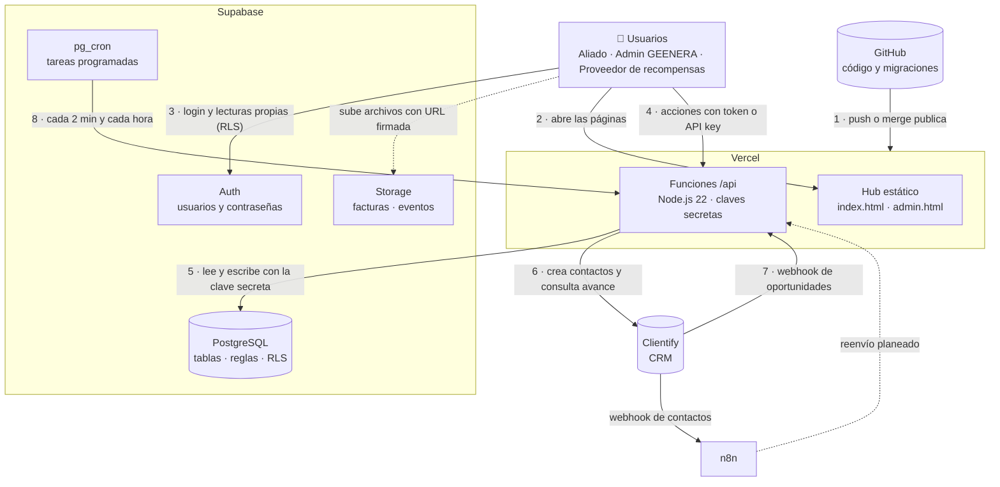
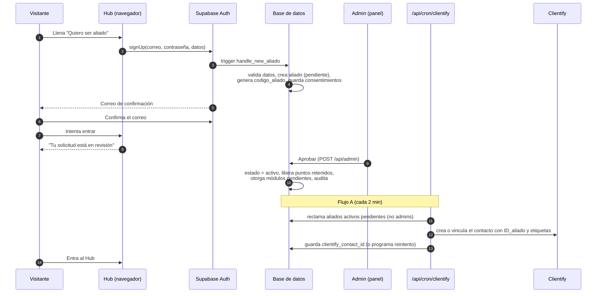
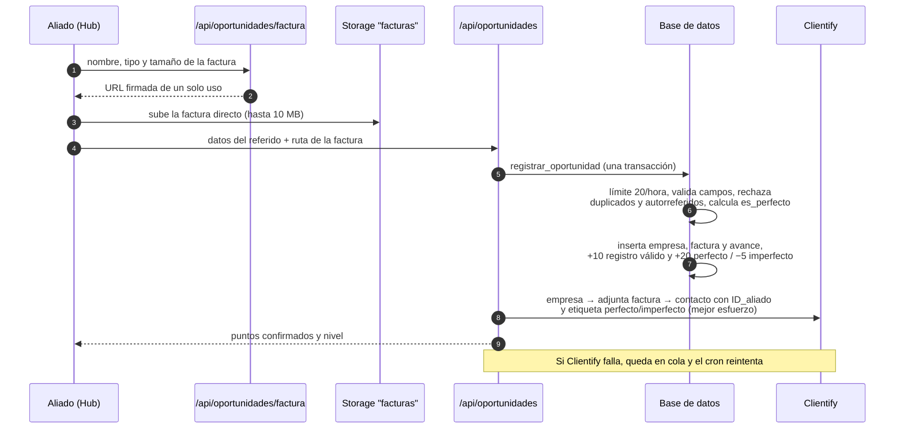
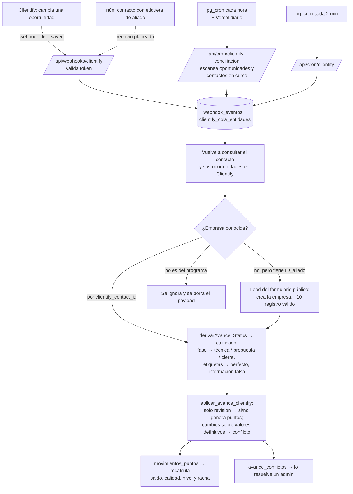
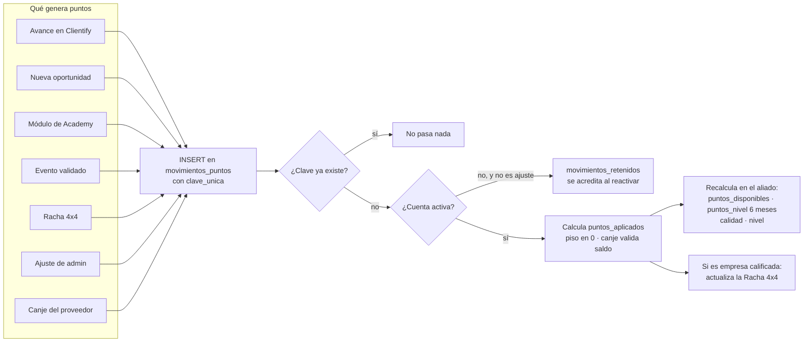
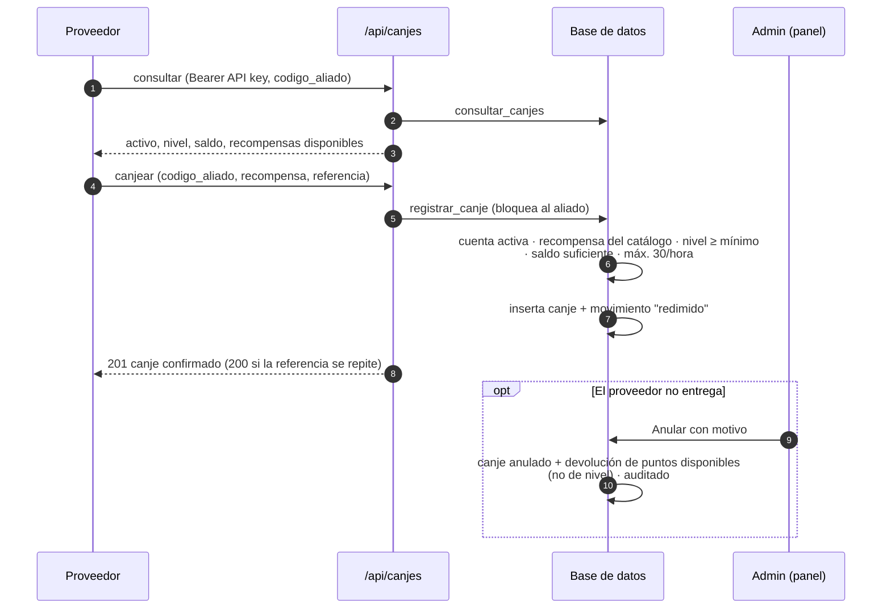
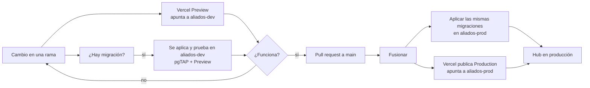
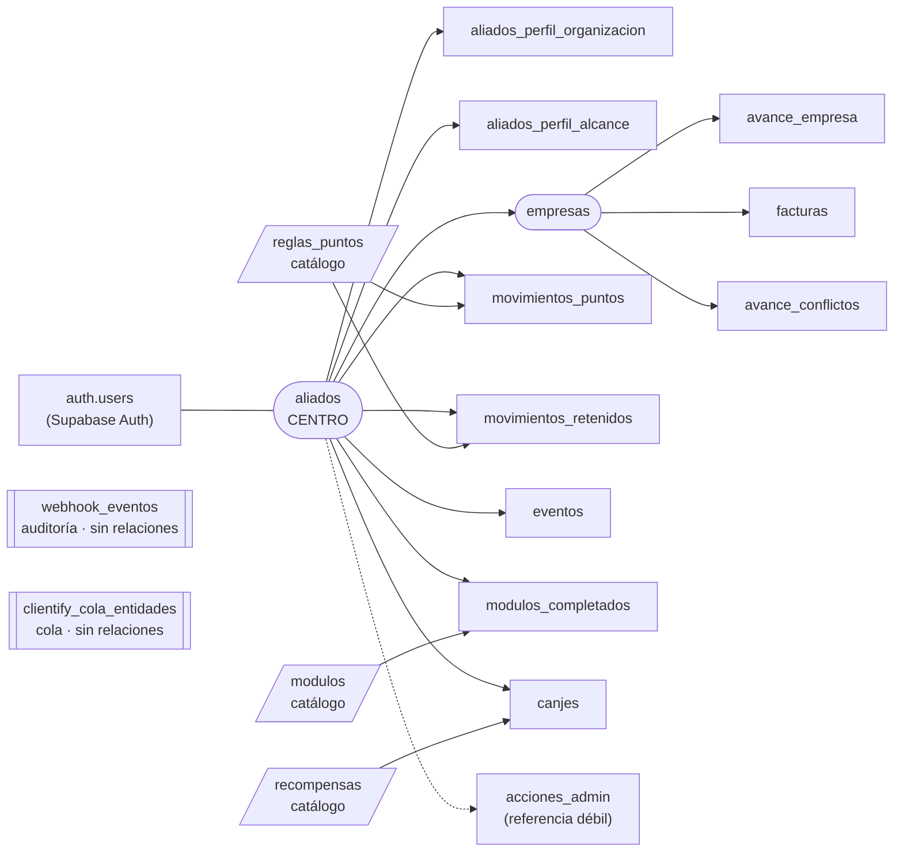

# Guía integral del Aliados del Sol Hub

> **Para qué sirve este documento.** Reúne en un solo lugar cómo funciona el Hub, por qué se construyó así, las decisiones del equipo, el modelo de datos y los pasos para ponerlo en producción. Si se pierde una conversación con Claude, este archivo y `CLAUDE.md` bastan para retomar el trabajo.
>
> **Fecha de corte:** 30 de septiembre de 2026. **Estado:** fases 1 a 10 construidas, con pruebas automáticas en el entorno de pruebas (`aliados-dev`). Falta la prueba de aceptación de punta a punta (§10.1). Producción (`aliados-prod`) aún no tiene el esquema ni recibe aliados.
>
> **Documentos relacionados:** `CLAUDE.md` (contexto técnico permanente, más detallado en reglas e implementación), `docs/HANDOFF.md` y `docs/DESIGN_SYSTEM.md` (diseño del Hub).

---

## Contenido

1. [Qué es el Hub, en una página](#1-qué-es-el-hub-en-una-página)
2. [Las plataformas y qué hace cada una](#2-las-plataformas-y-qué-hace-cada-una)
3. [Preguntas de infraestructura](#3-preguntas-de-infraestructura)
4. [Planes gratuitos y de pago: ¿hace falta Pro?](#4-planes-gratuitos-y-de-pago-hace-falta-pro)
5. [Flujos de trabajo (diagramas)](#5-flujos-de-trabajo-diagramas)
6. [Reglas del programa: puntos, calidad, niveles](#6-reglas-del-programa-puntos-calidad-niveles)
7. [Modelo de datos: tablas y columnas](#7-modelo-de-datos-tablas-y-columnas)
8. [Seguridad y variables de entorno](#8-seguridad-y-variables-de-entorno)
9. [Decisiones tomadas](#9-decisiones-tomadas)
10. [Del entorno de pruebas a producción: tres etapas](#10-del-entorno-de-pruebas-a-producción-tres-etapas)
11. [Pendientes y preguntas abiertas](#11-pendientes-y-preguntas-abiertas)
12. [Glosario](#12-glosario)

---

## 1. Qué es el Hub, en una página

**Aliados del Sol Hub** es la plataforma del programa de referidos de GEENERA. Personas y organizaciones (los **aliados**) refieren empresas que podrían instalar energía solar. Por cada avance real de esas empresas en el proceso comercial ganan **Puntos Sol**, suben de **nivel** y pueden **canjear recompensas**.

Lo que puede hacer cada persona hoy:

| Quién | Qué hace en el Hub |
|---|---|
| **Visitante** | Ve el sitio público, refiere una empresa por el formulario de Clientify ("Refiere tu empresa") y solicita ser aliado. |
| **Aliado pendiente** | Se registró y confirmó su correo, pero espera la aprobación de GEENERA. No entra al Hub. |
| **Aliado activo** | Entra al Hub: registra oportunidades ("Nueva oportunidad") con factura, sigue el avance de sus referidos, ve su historial de puntos, su nivel, su Racha Solar, hace cursos en la Academy, reporta eventos y ve sus canjes. |
| **Admin (equipo GEENERA)** | Usa el panel `admin.html`: aprueba o rechaza solicitudes, suspende o reactiva cuentas, ajusta puntos, valida eventos, resuelve conflictos con Clientify, administra el catálogo de recompensas y anula canjes. Todo queda auditado. |
| **Proveedor de recompensas** (sistema externo) | Consulta el saldo de un aliado por su código y registra canjes con su API key. |

**Tres ideas que explican casi todo el diseño:**

1. **Cada sistema es dueño de su información.** Supabase es dueño de los puntos y los aliados; Clientify es dueño del proceso comercial; Vercel solo muestra la interfaz y conecta los dos.
2. **Los puntos se escriben en un libro mayor que solo acepta inserciones.** Nunca se edita un saldo a mano: se registran movimientos y la base recalcula todo. Eso da trazabilidad y evita puntos duplicados.
3. **El navegador nunca habla con Clientify ni ve las claves secretas.** Todo lo sensible ocurre en funciones de servidor (`/api`) o dentro de la base de datos, protegido por reglas de seguridad por fila (RLS).

---

## 2. Las plataformas y qué hace cada una

| Plataforma | Rol en el Hub | Es dueña de | Dónde se configura |
|---|---|---|---|
| **GitHub** (`jmanurodri04-glitch/Aliados-del-sol-hub`) | Guarda el código y su historia. Cada fase se trabajó en su propia rama y entra a `main` por un *pull request*. | El código fuente, las migraciones de la base y las pruebas. | github.com |
| **Vercel** | Publica el sitio (HTML/CSS/JS estático) y ejecuta las funciones de servidor de la carpeta `/api` (Node.js 22). Cada rama genera un despliegue de prueba (*Preview*); `main` genera Producción. También ejecuta un cron diario. | La interfaz y la lógica de integración. | vercel.com → proyecto → Settings |
| **Supabase** (dos proyectos: `aliados-dev` y `aliados-prod`, región us-east-1) | Base de datos PostgreSQL, autenticación (usuarios y contraseñas), almacenamiento de archivos (facturas y registros de asistentes) y tareas programadas (`pg_cron`). Aquí viven las reglas de puntos, niveles y seguridad. | Aliados, credenciales, puntos, niveles, racha, módulos, eventos, canjes y la copia de trabajo de las empresas referidas. | supabase.com → proyecto |
| **Clientify** (CRM) | Donde el equipo comercial trabaja los leads, las empresas y las oportunidades. El Hub le envía aliados y referidos y lee su avance (Status del contacto, fase de la oportunidad, etiquetas). | El proceso comercial. | Clientify → Configuración |
| **n8n** | Automatizaciones existentes de GEENERA. Recibe el webhook de **contactos** de Clientify (no se cambió). Está planeada una rama que reenvíe al Hub los leads del formulario público. | Sus propios flujos. | Instancia n8n de GEENERA |

### Diagrama general de la arquitectura



**Cómo leerlo:** el navegador del aliado solo usa dos cosas públicas: la dirección de Supabase y su *publishable key* (la seguridad la da RLS). Todo lo que requiere permisos especiales (registrar una oportunidad, aprobar un aliado, hablar con Clientify, canjear) pasa por una función de `/api`, que usa la **clave secreta** de Supabase y la **API key** de Clientify guardadas como variables de entorno en Vercel.

### Qué hay en el repositorio

| Carpeta o archivo | Contenido |
|---|---|
| `index.html` y `src/Aliados del Sol Hub.dc.html` | El Hub (el cuerpo de ambos debe ser idéntico). |
| `admin.html` + `js/admin.js` | Panel de administración. |
| `js/supabase.js` | Toda la conexión del Hub con Supabase y con `/api` (eventos `ads:*`). |
| `api/` | Funciones de servidor (12, ver §8). |
| `lib/` | Código compartido de servidor: sesión, cliente de Supabase, integración Clientify (`lib/clientify/`). |
| `supabase/migrations/` | Cambios de la base de datos, en orden. **Es la única forma de cambiar el esquema.** |
| `supabase/tests/database/` | Pruebas pgTAP de las reglas de la base. |
| `tests/` | Pruebas de las funciones `/api` (`npm test`). |
| `vercel.json` | Configuración de Vercel: duración de funciones, cron diario y encabezados. |
| `assets/legal/` | Términos y Política de datos en PDF, con la fecha de versión en el nombre. |

---

## 3. Preguntas de infraestructura

### 3.1 ¿Por qué hay dos bases de datos, `aliados-dev` y `aliados-prod`?

Porque **probar sobre datos reales es peligroso** y en este sistema hay cosas que no se pueden deshacer fácilmente:

- **El libro de puntos solo acepta inserciones.** Un error en una prueba (por ejemplo, otorgar +150 a un aliado real) queda registrado para siempre y solo se corrige con otro movimiento.
- **Las migraciones cambian la estructura.** Una migración con un error puede bloquear el registro o borrar datos. En `dev` se aplica primero, se prueba con pgTAP y con el Preview de Vercel, y solo después se aplica igual en `prod`.
- **Hay datos personales (Ley 1581).** Los datos de prueba no deben mezclarse con los de aliados y empresas reales.
- **Los procesos automáticos se ejecutan solos.** Los cron jobs y los webhooks trabajan cada 2 minutos. En `dev` pueden fallar sin afectar a nadie.

**Regla de trabajo:** el conector de Supabase de Claude apunta **solo a `aliados-dev`** (ref `aqqlagfvanuokhmfyynv`). `aliados-prod` (ref `pysyxycrybayhrescplc`) nunca se toca desde las sesiones de desarrollo: se actualiza aplicando las mismas migraciones del repositorio, de forma controlada (ver §10).

**Clientify es uno solo** para pruebas y producción. Por eso, fuera de Producción el Hub solo envía a Clientify correos que contengan `+prueba` y les pone la etiqueta `PRUEBA HUB`, para poder identificarlos y borrarlos.

### 3.2 ¿Por qué Vercel tiene variables de *Production*, *Preview* y *Development*?

Vercel crea un **despliegue distinto según el origen del código**, y cada uno puede usar valores diferentes de las mismas variables:

| Entorno de Vercel | Cuándo se crea | A qué base apunta | Para qué sirve |
|---|---|---|---|
| **Production** | Al fusionar en `main` (o al promover un despliegue). Responde en el dominio oficial. | `aliados-prod` | Los aliados reales. |
| **Preview** | En cada *push* a cualquier otra rama (p. ej. `fase-10-canjes`). Tiene una URL propia por rama y por despliegue. | `aliados-dev` | Probar una funcionalidad antes de fusionarla, sin tocar producción. |
| **Development** | Cuando un desarrollador ejecuta `vercel dev` en su computador (`vercel env pull` descarga estas variables). | `aliados-dev` | Desarrollo local. |

Como el sitio es estático y no tiene paso de *build*, el navegador **no puede leer variables de entorno**. Por eso existe `GET /api/config`, que devuelve la URL y la *publishable key* del entorno donde corre. Así el mismo código sirve para Preview (dev) y Production (prod) sin cambiar nada.

**Consecuencia práctica:** la variable `SUPABASE_URL`, por ejemplo, tiene dos valores en Vercel: el de `aliados-prod` marcado solo para *Production* y el de `aliados-dev` marcado para *Preview* y *Development*.

### 3.3 ¿Por qué ramas por fase y *pull requests*?

- Cada fase (1 a 10) se construyó en su propia rama (`fase-1-base-datos` … `fase-10-canjes`). Cada rama se construyó sobre la anterior, así que **`fase-10-canjes` contiene todo**.
- Una rama genera un Preview en Vercel que apunta a `dev`: se puede probar la fase completa con un enlace, sin afectar producción.
- El *pull request* hacia `main` es el punto de control: se revisa qué cambia, y al fusionarlo Vercel publica Producción.
- **Importante:** fusionar en `main` publica el **código**, pero **no** cambia la base de `prod`. Las migraciones de la base se aplican aparte (§10.2, paso 2). Por eso el orden de puesta en marcha importa.

### 3.4 ¿Por qué parte de la lógica está en la base de datos y no en el código de Vercel?

Las reglas críticas (puntos, niveles, racha, límites, validaciones de admin) están en **funciones SQL dentro de Supabase**, no solo en JavaScript, porque:

- **Se ejecutan en una transacción:** o se hace todo (insertar el canje y descontar los puntos) o nada.
- **Bloquean la fila del aliado:** dos operaciones simultáneas no pueden gastar el mismo saldo.
- **No dependen de quién llama:** el Hub, el panel, un webhook o un cron pasan por las mismas reglas.
- **Se prueban con pgTAP** (unas 500 verificaciones entre todas las fases).

Las funciones de Vercel se encargan de lo que la base no puede hacer: verificar el token de sesión, hablar con Clientify, generar URLs firmadas y responder al navegador.

---

## 4. Planes gratuitos y de pago: ¿hace falta Pro?

> Datos tomados de la documentación oficial de Vercel y Supabase en septiembre de 2026. Los precios están en dólares y pueden cambiar: confírmalos en vercel.com/pricing y supabase.com/pricing antes de pagar.

### 4.1 Vercel: Hobby frente a Pro

| Aspecto | Hobby (gratis) | Pro (USD 20 por usuario/mes, incluye USD 20 de consumo) |
|---|---|---|
| **Uso permitido** | **Solo personal y no comercial.** | Uso comercial. |
| Cron jobs de Vercel | Máximo 1 ejecución al día por cron. | Hasta cada minuto. |
| Funciones | El equipo trabaja con el tope de **12 funciones por despliegue**; hoy el Hub usa exactamente 12. | Sin ese tope práctico. |
| Duración máxima de una función | Menor. | Mayor (el Hub pide hasta 60 s). |
| Volver a un despliegue anterior (*rollback*) | Limitado. | Sí, con un clic o `vercel rollback`. |
| Equipo | Una sola persona. | Varios miembros con roles. |
| Protección de despliegues y soporte | Básico. | Más opciones y soporte. |

**Recomendación: pasar Vercel a Pro antes de abrir el programa al público.**

1. **Condiciones de uso.** El Hub es de una empresa (GEENERA) y es parte de su operación comercial. El plan Hobby solo admite uso personal y no comercial, así que Producción en Hobby incumpliría las condiciones de Vercel.
2. **Límite de funciones.** Con 12 funciones el Hub llegó al tope de Hobby: cualquier endpoint nuevo exigiría unir funciones.
3. **Operación.** Poder revertir un despliegue malo en segundos y tener a varias personas de GEENERA con acceso es importante en producción.

Los cron frecuentes **no** dependen de Vercel Pro: el Hub los ejecuta desde Supabase (`pg_cron`), así que funcionan en cualquier plan de Vercel. El cron diario de Vercel es solo un respaldo.

Hoy la cuenta está en **prueba de Pro** (quedaban 6 días al 29 de septiembre). Si la prueba termina sin pagar, la cuenta vuelve a Hobby: el sitio sigue funcionando mientras no se superen los límites, pero se pierde lo anterior.

### 4.2 Supabase: Free frente a Pro

| Aspecto | Free (gratis) | Pro (USD 25/mes por organización + cómputo) |
|---|---|---|
| **Pausa por inactividad** | **Se pausa** si durante 7 días no hay suficiente actividad. Avisa por correo; se reactiva a mano. | Nunca se pausa. |
| **Copias de seguridad** | No hay copias descargables. Se recomienda exportar a mano (`supabase db dump`). | Copia diaria automática, 7 días de historial y restauración desde el panel. |
| Proyectos | 2 proyectos gratis en total. | Ilimitados; cada proyecto paga su cómputo. |
| Tamaño de la base | 500 MB por proyecto. | 8 GB incluidos por proyecto. |
| Archivos (Storage) | 1 GB. | 100 GB. |
| Usuarios activos al mes | 50 000. | 100 000. |
| Transferencia (egress) | 5 GB. | 250 GB. |
| Soporte | Comunidad. | Soporte por ticket. |
| Cómputo | Nano incluido. | USD 10 de crédito al mes, que cubre un proyecto Micro (~USD 10). Cada proyecto adicional suma su cómputo. |

**Recomendación: pasar a Pro solo la organización de `aliados-prod`, cuando se abra el registro a aliados reales.** Motivos:

1. **La pausa sería una caída del programa.** Si en una semana no hay suficiente actividad (algo probable al inicio), Supabase pausa el proyecto: el Hub, el login y la sincronización con Clientify dejan de funcionar hasta que alguien lo reactive.
2. **Las copias de seguridad son indispensables.** El libro de puntos y los datos de aliados son registros del programa. En Free no hay copia automática descargable.
3. **Los límites de Free alcanzan para empezar** (500 MB y 1 GB de facturas dan para cientos de aliados), así que el motivo de pagar es la **disponibilidad y la seguridad**, no el espacio.

**Cómo hacerlo sin pagar dos veces:** Supabase cobra por **organización** y no mezcla planes dentro de una organización. Se puede dejar `aliados-dev` en una organización gratuita y `aliados-prod` en una organización Pro. Así el costo es de unos **USD 25/mes** (el crédito de cómputo cubre un proyecto Micro). Si ambos proyectos quedaran en la misma organización Pro, se pagaría además el cómputo de `dev` (~USD 10/mes).

**Mientras siga en Free:** entrar al panel de Supabase al menos una vez por semana, responder los correos de aviso de pausa y exportar la base periódicamente.

### 4.3 Costo mensual estimado para arrancar

| Concepto | Costo aproximado (USD/mes) |
|---|---|
| Vercel Pro (1 usuario) | 20 |
| Supabase Pro (organización de `prod`, 1 proyecto Micro) | 25 |
| Supabase Free (organización de `dev`) | 0 |
| Servicio de correo SMTP (p. ej. Resend, Brevo, SES; ver §10.2, paso 3) | 0–20 según volumen |
| **Total aproximado** | **45–65** |

---

## 5. Flujos de trabajo (diagramas)

### 5.1 Registro y aprobación de un aliado



**Por qué así:** la contraseña la maneja solo Supabase Auth (nunca se guarda en las tablas). El aliado no se envía a Clientify al registrarse sino al aprobarse, para no llenar el CRM de solicitudes que se rechazarán. Si Clientify falla, ni el registro ni la aprobación fallan: queda en cola y se reintenta.

### 5.2 Nueva oportunidad desde el Hub (flujo B)



### 5.3 Avance comercial desde Clientify (flujo C) y conciliación



**Por qué así:**

- **Se vuelve a consultar Clientify** en vez de confiar en el webhook: el webhook puede llegar incompleto, repetido o desordenado.
- **La cola agrupa eventos:** si llegan cinco eventos de la misma oportunidad, se procesa una sola vez.
- **La conciliación horaria** cubre lo que no llega por webhook. El webhook de contactos va a n8n, así que los cambios de Status llegan como máximo con una hora de retraso.
- **Cada variable da puntos una sola vez en toda su vida** (clave única). Por eso reprocesar es inofensivo.

### 5.4 Cómo se mueven los puntos



### 5.5 Eventos aliados

1. El aliado reporta el evento en Puntos Sol → "Reporta un evento", con archivo de asistentes opcional (URL firmada al bucket privado `eventos`). Máximo 5 al día.
2. Queda `pendiente`. En el panel, un admin ve si cumple las 4 condiciones: evento realizado, GEENERA involucrada, registro de asistentes y al menos 5 empresas dentro del perfil.
3. **Validar** otorga +100 una sola vez (clave `evento:{id}`). **Rechazar** exige un motivo, que el aliado ve.

### 5.6 Canjes



### 5.7 De un cambio en el código a producción



**Orden importante:** si el código nuevo usa una tabla o función nueva, la migración en `prod` debe aplicarse **antes o al mismo tiempo** que la publicación. Si no, Producción mostrará errores hasta que se aplique.

### 5.8 Tareas programadas

| Tarea | Dónde | Frecuencia (hora Bogotá) | Qué hace |
|---|---|---|---|
| `sincronizar-clientify-aliados` | Supabase `pg_cron` → `/api/cron/clientify` | Cada 2 min | Procesa las colas: aliados aprobados (flujo A), oportunidades (flujo B) y eventos de Clientify (flujo C). |
| `conciliar-clientify` | Supabase `pg_cron` → `/api/cron/clientify-conciliacion` | Cada hora, minuto 7 | Escanea oportunidades y contactos en curso para cubrir webhooks perdidos. |
| Conciliación de respaldo | Vercel Cron (`vercel.json`) | Diario 02:00 | Lo mismo, como respaldo si `pg_cron` falla. |
| `recalcular-puntos-diario` | Supabase `pg_cron` | Diario 00:15 | Recalcula saldos y niveles (los puntos de nivel vencen a los 6 meses). |
| `reiniciar-rachas-semanal` | Supabase `pg_cron` | Lunes 00:05 | Reinicia rachas completadas o interrumpidas. |
| `otorgar-modulos-mensual` | Supabase `pg_cron` | Día 1, 00:05 | Otorga módulos pendientes dentro del tope de 20 puntos del mes. |
| `depurar-webhooks-clientify` | Supabase `pg_cron` | Día 1, 03:30 | Vacía los payloads de webhooks de más de 90 días (datos personales). |

Los cron de Supabase que llaman a Vercel necesitan tres secretos en el **Vault** de cada proyecto: `clientify_sync_url` (URL del despliegue), `cron_secret` (igual a `CRON_SECRET` de Vercel) y, si el despliegue está protegido, `vercel_bypass_secret`. Sin ellos, el job no hace nada.

---

## 6. Reglas del programa: puntos, calidad, niveles

### 6.1 Tabla de Puntos Sol

| Qué pasa | Puntos | Se otorga… |
|---|---|---|
| Registro válido de un referido | +10 | Una vez por empresa |
| Referido perfecto (10 campos + factura) | +20 | Una vez por empresa (comparte clave con imperfecto) |
| Referido imperfecto | −5 | Idem |
| Empresa calificada (Status "lead caliente" o superior) | +30 | Una vez (comparte clave con no calificado) |
| Referido no calificado | −10 | Idem |
| Fuera del perfil (no calificado **y** perfecto) | −15 | Se suma al −10: −25 en total |
| Evaluación técnica (fase "Diseño" o posterior) | +30 | Una vez |
| Propuesta comercial (fase "Presentación de oferta" o posterior) | +50 | Una vez |
| Negocio cerrado (fase "Contrato") | +150 | Una vez |
| Información falsa (etiquetas "fraude", "no existe", "información de contacto errónea") | −30 | Una vez |
| Baja calidad reiterada (la registra un admin) | −20 | Máximo una por aliado y día |
| Módulo de Academy completado | Según el módulo (hoy 5 o 0) | Máximo 20 puntos por mes; lo que no cabe espera al mes siguiente |
| Evento aliado validado | +100 | Una vez por evento |
| Racha Solar 4x4 completada | +75 | Máximo una cada 28 días |
| Ajuste de admin | ± | Con justificación |
| Canje | − (valor de la recompensa) | Solo con saldo suficiente |

**Reglas generales:**

- **Nada genera puntos dos veces.** Cada evento tiene una clave única. Si Clientify cambia después un valor definitivo (por ejemplo, de "no calificado" a "calificado"), no se dan puntos automáticamente: queda un **conflicto** para un admin.
- **"En revisión" nunca da ni quita puntos.**
- **Piso en 0 y sin memoria.** El saldo nunca es negativo. Si una penalización es mayor que el saldo, se descuenta lo que haya y el resto se pierde (no queda deuda).
- **Dos saldos:**
  - `puntos_disponibles`: lo que se puede canjear. Es histórico y no vence.
  - `puntos_nivel`: ganados menos perdidos de los **últimos 6 meses**, con piso en 0. Sirve para el nivel. Un canje no los descuenta y la devolución de un canje anulado tampoco los suma.
- **Cuenta no activa:** si el aliado está pendiente o suspendido, sus puntos quedan **retenidos** y se acreditan al activarse. Los ajustes de admin se aplican siempre.

### 6.2 Calidad de referidos

```
calidad_empresa = 100 × (0,40·calificado + 0,30·perfecto + 0,20·evaluación técnica + 0,10·integridad)
```

Cada variable vale 1 si es "sí" y 0 si es "no". Si **alguna** está "en revisión", la empresa no cuenta todavía (para no castigar lo que está en proceso). La calidad del aliado es el promedio de sus empresas evaluables, sin ventana de tiempo. El *lead scoring* de Clientify **no** se usa para la calidad.

### 6.3 Niveles

| Nivel | Puntos de nivel ≥ | Calidad ≥ |
|---|---|---|
| Círculo Solar | 1000 | 85 % |
| Diamante | 700 | 80 % |
| Platino | 450 | 70 % |
| Oro | 250 | 60 % |
| Plata | 100 | 50 % |
| Bronce | 0 | — |

El nivel es **el menor** entre el que dan los puntos y el que da la calidad. Ejemplo: 1000 puntos con 60 % de calidad = Oro. El Hub no muestra los requisitos de calidad, pero la regla sí se aplica.

### 6.4 Racha Solar 4x4

Una semana (lunes a domingo, hora Bogotá) cuenta si en ella **se calificó** al menos una empresa del aliado. Cuatro semanas seguidas = +75. La racha se ve completa el resto de esa semana y se reinicia el lunes siguiente; una semana sin calificaciones la reinicia.

---

## 7. Modelo de datos: tablas y columnas

### 7.1 Por qué unas tablas se relacionan con casi todo y otras con nada



*Flecha continua: la tabla de la derecha guarda una llave foránea hacia la de la izquierda. Flecha punteada: referencia débil (se vacía si se borra la cuenta). Paralelogramos: catálogos. Doble borde: tablas independientes a propósito.*

**`aliados` es el centro** porque todo en el programa le pertenece a un aliado: sus empresas, sus puntos, sus eventos, sus módulos, sus canjes. Por eso casi todas las tablas tienen una columna `aliado_id` que apunta a `aliados.id`. Esa relación permite:

- **Seguridad:** la regla RLS "cada aliado solo lee sus filas" se escribe como `aliado_id = auth.uid()`.
- **Borrado completo:** si una persona pide eliminar su cuenta (Ley 1581), al borrar el usuario se borra en cascada todo lo suyo.
- **Cálculos:** los saldos, la calidad y el nivel se recalculan filtrando por `aliado_id`.

**`empresas` es el segundo centro:** cada referido tiene su avance (`avance_empresa`), su factura (`facturas`) y sus conflictos con Clientify (`avance_conflictos`).

**Tablas sin relaciones, a propósito:**

| Tabla | Por qué no se relaciona |
|---|---|
| `webhook_eventos` | Es un **registro de auditoría** de lo que llegó de Clientify. Se guarda tal cual, aunque el contacto no sea del programa o todavía no exista en la base. Si tuviera llaves foráneas, un evento de una empresa aún desconocida no se podría guardar, y se perdería. |
| `clientify_cola_entidades` | Es una **cola de trabajo** identificada por los IDs de Clientify (`entidad`, `entidad_id`), no por IDs internos. Se vacía a medida que se procesa. |
| `reglas_puntos`, `modulos`, `recompensas` | Son **catálogos**: no apuntan a nadie, pero otras tablas apuntan a ellos (`movimientos_puntos.motivo`, `modulos_completados.modulo_id`, `canjes.recompensa_id`). Sus filas no se pueden borrar si están en uso. |
| `acciones_admin` | Se relaciona con `aliados` de forma **débil**: si se borra la cuenta, la referencia queda vacía pero se conserva el código en texto (`admin_codigo`, `aliado_codigo`), para que la auditoría no se pierda. |

**Por qué `movimientos_puntos.vinculo_id` es texto y no una llave foránea:** un movimiento puede venir de una empresa, un evento, un módulo, una racha, un canje o un ajuste. Una sola columna no puede apuntar a seis tablas distintas. Por eso se guardan dos datos, `vinculo` (qué tabla) y `vinculo_id` (qué fila), y las vistas unen según el caso.

**Llaves compuestas entre `empresas` y `facturas`:** la factura apunta a (`empresa_id`, `aliado_id`) de la empresa, y la empresa apunta a (`factura_id`, `id`) de la factura. Así la base garantiza que una factura no pueda quedar asociada a la empresa de otro aliado.

### 7.2 Estados y tipos que se repiten

| Tipo | Valores | Uso |
|---|---|---|
| `estado_triple` | `si`, `no`, `revision` | Variables de avance y calidad: "revision" = aún no se sabe. |
| `tipo_aliado` | `financiero`, `emi`, `linker`, `cliente_embajador`, `agremiaciones` | Define el formulario, el perfil y el dashboard. |
| `nivel` | `bronce`, `plata`, `oro`, `platino`, `diamante`, `circulo_solar` | Nivel del aliado y nivel mínimo de una recompensa (el orden importa: se comparan). |
| `aliados.estado` | `pendiente`, `activo`, `suspendido`, `rechazado` | Solo `activo` entra al Hub y gana puntos. |
| `clientify_sync_estado` | `pendiente`, `ok`, `error`, `excluido` | Estado del envío a Clientify; `excluido` = cuenta de admin. |

### 7.3 Tablas del aliado

#### `aliados` — el aliado y sus valores calculados

| Columna | Qué representa |
|---|---|
| `id` | Llave técnica, igual al usuario de Supabase Auth. **Nunca se muestra ni sale del sistema.** |
| `codigo_aliado` | Código público (p. ej. `LKCAL5SCPTB9T`): prefijo del tipo + iniciales + 8 caracteres. Es el `ID_aliado` de Clientify. Inmutable. |
| `nombre_completo`, `correo`, `celular`, `regional` | Datos del registro. El correo es único; el celular en formato internacional (+57…). |
| `tipo_aliado` | Tipo de aliado (§7.2). |
| `puntos_nivel` | Puntos de los últimos 6 meses, con piso en 0. Define el nivel. **Calculado.** |
| `puntos_disponibles` | Saldo canjeable, histórico. **Calculado.** |
| `calidad_referidos` | Promedio de calidad de sus empresas evaluables (0–100) o vacío. **Calculado.** |
| `nivel` | Nivel vigente. **Calculado.** |
| `racha_semana_1..4`, `racha_ultima_semana` | Estado de la Racha Solar y el lunes de la última semana contada. |
| `clientify_contact_id` | ID del contacto del aliado en Clientify. |
| `clientify_sync_estado`, `clientify_sync_error`, `clientify_sync_intentos`, `clientify_sync_proximo_at`, `clientify_sync_at` | Cola del flujo A: estado, último error, reintentos, cuándo reintentar y última sincronización exitosa. |
| `autorizacion_datos_at`, `terminos_aceptados_at` | Cuándo autorizó el tratamiento de datos y aceptó los términos (Ley 1581). |
| `terminos_version`, `politica_datos_version` | Qué versión de cada documento aceptó. |
| `estado` | `pendiente`, `activo`, `suspendido`, `rechazado`. |
| `aprobado_at`, `aprobado_por` | Cuándo y qué admin aprobó la solicitud. |
| `rol` | `aliado` o `admin`. Nunca se toma del navegador. |
| `created_at`, `updated_at` | Fechas de creación y de última modificación. |

#### `aliados_perfil_organizacion` — Financieros y Agremiaciones (1 a 1)

| Columna | Qué representa |
|---|---|
| `aliado_id` | El aliado (llave primaria y foránea). |
| `organizacion`, `cargo` | Entidad y cargo del aliado. |
| `created_at`, `updated_at` | Fechas. |

#### `aliados_perfil_alcance` — EMI, Linker y Cliente Embajador (1 a 1)

| Columna | Qué representa |
|---|---|
| `aliado_id` | El aliado. |
| `como_llega_empresas` | Respuesta a "¿Cómo llegas a las empresas?". |
| `created_at`, `updated_at` | Fechas. |

> **Por qué dos tablas de perfil y no columnas en `aliados`:** cada tipo pide datos distintos. Separarlos evita columnas vacías y permite que la base valide que el perfil corresponda al tipo.

### 7.4 Referidos

#### `empresas` — cada referido

| Columna | Qué representa |
|---|---|
| `id` | Llave interna de la empresa referida. |
| `aliado_id` | Aliado que la refirió (siempre tomado de la sesión, nunca del formulario). |
| `origen` | `hub` (Nueva oportunidad) o `clientify_form` (formulario público). |
| `empresa`, `sector`, `subsector`, `ciudad` | Datos de la empresa. Obligatorios desde el Hub; pueden faltar si vienen del formulario público. |
| `nombre_contacto`, `cargo`, `telefono`, `correo` | Contacto en la empresa. El correo es único en todo el programa: gana el primer aliado. |
| `valor_factura` | Valor mensual de la factura de energía (COP). |
| `observaciones` | Comentarios libres (no cuentan para "perfecto"). |
| `factura_id` | Factura adjunta, si hay. |
| `es_perfecto` | Si se registró con los 10 campos + factura. Se calcula al guardar. |
| `clientify_contact_id`, `clientify_company_id`, `clientify_deal_id` | IDs del contacto, la empresa y la oportunidad en Clientify. |
| `clientify_sync_estado`, `clientify_sync_error`, `clientify_sync_intentos`, `clientify_sync_proximo_at`, `clientify_sync_at` | Cola del flujo B (envío a Clientify). |
| `autorizacion_contacto_at` | Cuándo el aliado declaró tener autorización del contacto (Ley 1581). Obligatoria desde el Hub. |
| `created_at`, `updated_at` | Fechas. |

#### `facturas` — factura adjunta a un referido

| Columna | Qué representa |
|---|---|
| `id` | Llave de la factura. |
| `empresa_id`, `aliado_id` | Empresa y aliado dueños (llave compuesta con `empresas`). |
| `tipo_documento` | `pdf`, `jpg` o `png`. |
| `storage_path` | Ruta en el bucket privado `facturas`: `{aliado}/{empresa}/{archivo}`. |
| `nombre_archivo` | Nombre original del archivo. |
| `fecha_carga` | Cuándo se subió. |
| `validacion`, `aprobado` | Revisión de la factura por GEENERA (`pendiente`/`revisado`; `si`/`no`/`revision`). |
| `clientify_subida_at` | Cuándo se adjuntó a la empresa en Clientify. |

#### `avance_empresa` — espejo del avance en Clientify (1 a 1 con `empresas`)

| Columna | Qué representa |
|---|---|
| `empresa_id` | La empresa. |
| `calificado` | Del Status del contacto (caliente o superior = sí; no calificado = no). |
| `perfecto` | Inicia con `es_perfecto`; Clientify puede corregirlo con la etiqueta. |
| `oportunidad_tecnica` | Evaluación técnica: la oportunidad llegó a "Diseño". |
| `integridad_informacion` | Sigue a `calificado`. Solo cuenta para la calidad. |
| `calidad_empresa` | Calidad ponderada (0–100) o vacía si algo sigue en revisión. **Calculada.** |
| `propuesta_comercial`, `negocio_cerrado` | La oportunidad llegó a "Presentación de oferta" / "Contrato". |
| `informacion_falsa` | Etiquetas de fraude en Clientify. |
| `fuera_perfil` | No calificado y perfecto. |
| `estado_contacto_clientify` | Status crudo del contacto (p. ej. `hot-lead`). |
| `fase_oportunidad`, `fase_oportunidad_num` | Fase cruda de la oportunidad y su número. |
| `estado_oportunidad` | `abierta`, `ganada` o `perdida`. |
| `lead_scoring` | Solo informativo (la API actual no lo entrega). |
| `valor_oportunidad` | Pipeline originado: suma del importe de oportunidades ganadas o en "Contrato". |
| `valor_cotizado` | Suma del importe de todas sus oportunidades de proyectos. |
| `potencia_instalada_kwp` | Suma de la "Potencia (kWp)" de las oportunidades cerradas. |
| `fecha_calificado` | Cuándo pasó a calificada (para la racha). |
| `clientify_updated_at`, `updated_at` | Última actualización desde Clientify y en la base. |

#### `avance_conflictos` — cambios de Clientify sobre valores ya definitivos

| Columna | Qué representa |
|---|---|
| `id` | Llave del conflicto. |
| `empresa_id` | Empresa afectada. |
| `variable` | Qué variable cambió (p. ej. `calificado`). |
| `valor_hub`, `valor_clientify` | Valor definitivo en el Hub y nuevo valor en Clientify. |
| `detectado_at` | Cuándo se detectó. |
| `resuelto_at`, `resuelto_por`, `nota` | Cuándo, quién y cómo lo resolvió un admin. |

### 7.5 Puntos

#### `reglas_puntos` — catálogo de motivos

| Columna | Qué representa |
|---|---|
| `motivo` | Código de la regla (p. ej. `empresa_calificada`). |
| `tipo` | `ganado`, `perdido` o `redimido` (vacío si puede ser ambos, como `ajuste_admin`). |
| `puntos` | Valor fijo; vacío si varía (módulos, ajustes, canjes). |
| `descripcion` | Texto que ve el aliado en el historial. |

#### `movimientos_puntos` — libro mayor (única fuente de verdad de los puntos)

| Columna | Qué representa |
|---|---|
| `id` | Llave del movimiento. |
| `aliado_id` | Aliado afectado. |
| `tipo` | `ganado`, `perdido` o `redimido`. |
| `puntos` | Valor nominal de la regla. |
| `puntos_aplicados` | Lo que realmente movió el saldo (una pérdida con saldo bajo aplica menos). |
| `motivo` | Regla aplicada (llave foránea a `reglas_puntos`). |
| `vinculo`, `vinculo_id` | Qué lo originó: `empresas`, `eventos`, `modulos_completados`, `racha`, `canjes` o `ajuste_admin`, y qué fila. |
| `clave_unica` | Evita duplicados (p. ej. `empresa:{id}:calificado`). |
| `fecha` | Cuándo se otorgó (define semanas, meses y la ventana de 6 meses). |
| `creado_por` | `sistema`, `webhook_clientify`, `canjes_api` o `admin:{id}`. |
| `nota` | Detalle (justificación del ajuste, nombre de la recompensa…). |
| `secuencia` | Orden exacto cuando dos movimientos tienen la misma hora. |

#### `movimientos_retenidos` — puntos en espera mientras la cuenta no está activa

Mismas columnas que el libro mayor, más: `fecha_original` (cuándo ocurrió), `estado_aliado` (por qué se retuvo) y `retenido_at`. Al activarse la cuenta pasan al libro mayor en su orden original y se borran de aquí.

### 7.6 Academy, eventos y canjes

#### `modulos` — catálogo de cursos

| Columna | Qué representa |
|---|---|
| `id` | Llave. |
| `codigo` | ID del curso en la Academy del Hub (`c11`, `c12`…). |
| `nombre`, `orden`, `activo` | Nombre, orden de aparición y si está disponible. |
| `puntos` | Valor del módulo (0–20; 0 = sin puntos). |
| `created_at`, `updated_at` | Fechas. |

#### `modulos_completados`

| Columna | Qué representa |
|---|---|
| `id` | Llave. |
| `aliado_id`, `modulo_id` | Quién completó qué (único por par). |
| `fecha_completado` | Cuándo lo terminó. |
| `puntos` | Valor del módulo en ese momento. |
| `recompensa_estado` | `pendiente` (espera cupo en el tope mensual), `otorgada` o `no_aplica`. |
| `fecha_otorgada` | Cuándo se dieron los puntos. |

#### `eventos` — eventos aliados

| Columna | Qué representa |
|---|---|
| `id`, `aliado_id` | Llave y aliado que lo reporta. |
| `nombre_evento`, `tipo_evento`, `fecha`, `descripcion` | Datos del evento. |
| `geenera_involucrada`, `registro_asistentes`, `empresas_perfil_count` | Las condiciones para los +100. |
| `registro_asistentes_path` | Archivo en el bucket privado `eventos`. |
| `estado` | `pendiente`, `validado` o `rechazado`. |
| `validado_por`, `validado_at`, `revision_nota` | Admin que lo revisó, cuándo y su nota o motivo de rechazo. |
| `created_at`, `updated_at` | Fechas. |

#### `recompensas` — catálogo de canjes

| Columna | Qué representa |
|---|---|
| `id` | Llave. |
| `codigo` | Código que usa el proveedor para canjear. Inmutable. |
| `nombre`, `descripcion`, `categoria` | Lo que ve el aliado. |
| `puntos` | Costo en Puntos Sol. |
| `nivel_minimo` | Nivel necesario para canjearla. |
| `proveedor` | Si tiene valor, solo ese proveedor puede canjearla. |
| `activa` | Si se puede canjear hoy. |
| `created_at`, `updated_at` | Fechas. |

#### `canjes`

| Columna | Qué representa |
|---|---|
| `id`, `aliado_id` | Llave y aliado. |
| `recompensa_id`, `recompensa` | Recompensa del catálogo y su nombre al momento del canje. |
| `puntos`, `nivel_requerido` | Puntos descontados y nivel exigido al momento del canje. |
| `proveedor`, `referencia_externa` | Quién lo registró y su número de operación (único por proveedor). |
| `fecha` | Cuándo. |
| `estado` | `confirmado` o `anulado`. |
| `anulado_at`, `anulado_por`, `anulacion_motivo` | Datos de la anulación. |

### 7.7 Integración y auditoría

#### `webhook_eventos` — lo que llegó de Clientify

| Columna | Qué representa |
|---|---|
| `id` | Llave. |
| `fuente` | Hoy solo `clientify`. |
| `payload` | Contenido recibido. Se vacía al procesarlo si no es del programa, y a los 90 días en todos los casos. |
| `recibido_at`, `procesado_at` | Cuándo llegó y cuándo se procesó. |
| `error` | Error o avisos del proceso (Status desconocido, conflictos…). |
| `entidad`, `entidad_id`, `accion` | Qué contacto u oportunidad y qué pasó (`created`, `saved`…). |

#### `clientify_cola_entidades` — cola de trabajo del flujo C

| Columna | Qué representa |
|---|---|
| `entidad`, `entidad_id` | Contacto u oportunidad de Clientify (llave primaria compuesta: una sola fila por entidad). |
| `origen` | Webhook o conciliación. |
| `programado_at` | Cuándo procesarla (permite esperas y reintentos). |
| `intentos`, `error` | Reintentos y último error. |
| `actualizado_at` | Última actualización. |

#### `acciones_admin` — auditoría del panel (solo inserción)

| Columna | Qué representa |
|---|---|
| `id` | Llave. |
| `admin_id`, `admin_codigo` | Admin que actuó (el código se conserva aunque se borre la cuenta). |
| `accion` | Qué hizo (aprobar, rechazar, suspender, ajustar, validar evento, anular canje, guardar recompensa…). |
| `aliado_id`, `aliado_codigo` | Aliado afectado, si aplica. |
| `objetivo` | Otro objeto afectado (`evento:{id}`, `canje:{id}`, `recompensa:{codigo}`…). |
| `detalle` | Motivo, puntos, valores anteriores, etc. |
| `created_at` | Cuándo. |

### 7.8 Vistas, archivos y funciones

- **Vistas del aliado** (cada una devuelve solo lo del usuario de la sesión): `v_aliado_dashboard`, `v_mis_movimientos`, `v_mis_referidos`, `v_mis_modulos`, `v_mis_eventos`, `v_mis_canjes` y `v_recompensas`. **Ninguna expone `aliados.id`.**
- **Vistas del admin** (vacías para quien no es admin): `v_admin_resumen`, `v_admin_aliados`, `v_admin_movimientos`, `v_admin_eventos`, `v_admin_conflictos`, `v_admin_canjes`, `v_admin_recompensas` y `v_admin_acciones`.
- **Buckets privados de Storage:**
  - `facturas`: PDF, JPG o PNG de hasta 10 MB.
  - `eventos`: PDF, imagen, Excel o CSV de hasta 10 MB.
  - El navegador sube con una URL firmada de un solo uso y solo el servidor lee.
- **Funciones principales:**
  - `handle_new_aliado`: registro.
  - `registrar_oportunidad`: Nueva oportunidad.
  - `aplicar_avance_clientify`: flujo C.
  - `completar_modulo` y `otorgar_modulos_pendientes`: Academy.
  - `registrar_evento`: eventos.
  - `registrar_canje` y `consultar_canjes`: canjes.
  - `admin_*`: acciones del panel.
  - `recalcular_aliado`, `calcular_nivel`, `calcular_puntos_nivel` y `calcular_puntos_disponibles`: cálculos.

---

## 8. Seguridad y variables de entorno

**Principios:**

- **RLS en las 18 tablas.** Un aliado solo puede **leer** sus propias filas. Las escrituras las hacen solo el servidor (clave secreta) o funciones controladas.
- **Nunca se muestra el `id` interno.** Hacia afuera (Clientify, proveedores, pantalla) solo sale el `codigo_aliado`.
- **Todo endpoint verifica la sesión y exige `estado = 'activo'`.** Las acciones de admin se verifican dos veces: en el endpoint y otra vez en la base.
- **Límites anti-abuso:** 20 referidos por hora, 5 eventos por día y 30 canjes por hora por aliado.
- **Las claves secretas nunca van en el código ni en los commits.**

**Variables de entorno en Vercel** (cada una con valor de `prod` para *Production* y de `dev` para *Preview*/*Development*):

| Variable | Qué es | ¿Llega al navegador? |
|---|---|---|
| `SUPABASE_URL` | Dirección del proyecto de Supabase. | Sí, por `/api/config`. |
| `SUPABASE_PUBLISHABLE_KEY` | Clave pública (la seguridad la da RLS). | Sí, por `/api/config`. |
| `SUPABASE_SECRET_KEY` | Clave secreta de servidor: salta RLS. | **Nunca.** |
| `CLIENTIFY_API_KEY` | Acceso a la API de Clientify. | **Nunca.** |
| `CLIENTIFY_WEBHOOK_SECRET` | Token que Clientify y n8n envían al webhook. | **Nunca.** |
| `CRON_SECRET` | Protege `/api/cron/*` (debe ser igual al `cron_secret` del Vault). | **Nunca.** |
| `CANJES_API_KEYS` | `proveedor:key,proveedor:key` (keys de 24+ caracteres). | **Nunca.** |

**Funciones de `/api` (12):**

| Función | Uso |
|---|---|
| `config` | Configuración pública. |
| `oportunidades/factura` y `oportunidades` | Nueva oportunidad. |
| `modulos` | Academy. |
| `eventos` | Reportar eventos. |
| `admin` | Acciones del panel. |
| `canjes` | Proveedores. |
| `webhooks/clientify` | Webhook de Clientify. |
| `cron/clientify`, `cron/clientify-aliados` (alias), `cron/clientify-conciliacion` y `cron/clientify-diagnostico` | Tareas programadas y diagnóstico. |

---

## 9. Decisiones tomadas

Resumen agrupado. El detalle y la sección de cada una están en `CLAUDE.md` §13.

**Registro y cuentas**
- Correo confirmado obligatorio y aprobación de GEENERA antes de entrar. Una solicitud rechazada queda en `rechazado` y se puede aprobar después.
- Celular internacional con selector de país; regla colombiana (10 dígitos que empiezan por 3) para +57.
- "¿Cómo llegas a las empresas?" es obligatoria para EMI, Linker y Cliente Embajador. La regional es opcional.
- Iniciales del código: se ignoran las partículas y se usan máximo 4 letras.
- Los Términos aplican a todos los tipos de aliado. La Política de datos debe incluir la transferencia internacional.
- El primer admin es `c.lizarazo@geenera.com`. Los roles se asignan por SQL: el panel no cambia roles.
- Las cuentas de admin no se sincronizan con Clientify.

**Clientify**
- El aliado se crea en Clientify al aprobarse, no al registrarse. Etiqueta "aliado del sol hub" para Cliente Embajador y "aliados del sol" para los demás.
- Las variables se derivan del Status del contacto, la fase de la oportunidad y las etiquetas. Clientify no tiene campos sí/no/revisión.
- Cuentan todos los embudos de proyectos, por el nombre de la fase ("Diseño", "Presentación de oferta", "Contrato"). Con varias oportunidades se usa la más avanzada.
- "0. lead perdido" = revisión. La fase "7. Interesado No ahora" cuenta como propuesta.
- Información falsa = etiquetas "fraude", "no existe" o "información de contacto errónea".
- Valor cotizado = suma del importe de todas las oportunidades. Pipeline originado = suma de las cerradas.
- La factura se adjunta a la **empresa** en Clientify, y la empresa se crea siempre.
- Un contacto se refiere una sola vez (gana el primer aliado) y no se admite el autorreferido.
- El webhook de contactos sigue en n8n; al Hub llega el de oportunidades, más una conciliación horaria.
- Los eventos de webhook ajenos al programa se borran al procesarlos. El resto se vacía a los 90 días.
- Un cambio de Clientify sobre un valor definitivo queda como conflicto para un admin.

**Puntos, calidad y niveles**
- "Información disponible" se eliminó. Referido perfecto = +20.
- Fuera del perfil (−15) se suma a no calificado (−10).
- Piso en 0 y sin memoria. Los puntos de un aliado no activo se retienen.
- La calidad usa siempre la fórmula ponderada y excluye las empresas en revisión. El *lead scoring* nunca se usa.
- Nivel = el menor entre el nivel por puntos y el nivel por calidad. El Hub no muestra el requisito de calidad.
- Racha: cuenta la fecha de calificación; se reinicia el lunes después de completarla; lo retenido no cuenta.
- Módulos: cada uno vale lo que diga el catálogo; tope de 20 puntos al mes, sin partir módulos y en orden de llegada.
- Máximo 20 referidos por hora.

**Hub, panel y canjes**
- Financieros y Agremiaciones también ven sus puntos y su nivel. Agremiaciones agrupan por la ciudad de la empresa referida.
- Las secciones sin datos reales muestran datos de demostración con la etiqueta "Demostración".
- Academy: en la base solo se guarda el curso completado; el avance por lección vive en el navegador.
- El panel es una página separada (`admin.html`). Los eventos los reporta el aliado y los valida un admin.
- El catálogo de recompensas se administra desde el panel. El proveedor puede consultar el nivel y el saldo por código, sin datos personales. Un admin puede anular un canje: se devuelve el saldo, no los puntos de nivel.

---

## 10. Del entorno de pruebas a producción: tres etapas

El camino tiene **tres etapas, en orden**. No se pasa a la siguiente sin cerrar la anterior:

| Etapa | Dónde ocurre | Con qué datos | Objetivo | Se cierra cuando… |
|---|---|---|---|---|
| **1. Pruebas de aceptación en dev** | Preview de Vercel (rama `fase-10-canjes`) + `aliados-dev` + Clientify con contactos `+prueba` | Datos de prueba, desechables | Comprobar con personas reales, de punta a punta, que todo funciona como el equipo espera | Todos los casos de la lista 10.1 pasan y los errores encontrados están corregidos |
| **2. Preparar producción** | `aliados-prod` + Vercel Production + dominio + Clientify | Ninguno todavía (base vacía) | Montar el mismo sistema ya probado, ahora en el entorno real | La configuración está completa y el primer admin entra al panel de producción |
| **3. Piloto y apertura** | Producción | Datos reales | Confirmar que producción quedó bien conectada y abrir el registro | El piloto pasa y se comunica el enlace a los aliados |

**Por qué separarlas:** en la etapa 1 los errores son baratos, porque los datos se pueden borrar y nada llega a aliados reales. En la etapa 3 cada movimiento de puntos es permanente y cada contacto en Clientify es real. La etapa 2 no debería descubrir errores de lógica, solo de configuración.

**El *pull request* hacia `main` se fusiona en la etapa 2, no antes.** Fusionar publica Production. Si se fusiona antes de terminar la etapa 1 y de configurar producción, el dominio oficial mostraría un sitio sin base de datos detrás.

### 10.0 Qué se ha probado hasta hoy y qué falta

| Ya verificado | Cómo | Qué **no** cubre |
|---|---|---|
| Reglas de la base (puntos, niveles, racha, módulos, eventos, canjes, permisos) | Unas 500 pruebas pgTAP ejecutadas en `aliados-dev` | Que las pantallas y Clientify las usen bien en la práctica |
| Funciones `/api` | 67 pruebas automáticas con Supabase y Clientify simulados | Llamadas reales a Clientify y a Storage |
| Pantallas del Hub y del panel | Pruebas en navegador con Supabase simulado | Datos reales, correos reales, tiempos reales de los cron |
| Registro, confirmación de correo y acceso de admin | La cuenta real de la primera admin en el Preview | El resto de los flujos |
| Estructura de Clientify (Status, fases, campos) | Diagnóstico contra la API real (fase 6) | El recorrido completo de un referido |

**Conclusión:** cada pieza está probada por separado, pero **falta la prueba de punta a punta con personas y con Clientify real**. Eso es la etapa 1, y es lo siguiente que hay que hacer.

### 10.1 Etapa 1 — Pruebas de aceptación en dev

**Preparación (una sola vez):**

1. **Usar un Preview fijo.** Vercel da a cada rama una URL estable del tipo `https://<proyecto>-git-fase-10-canjes-<equipo>.vercel.app`. Esa URL es la que se usa en todos los pasos siguientes.
   *Por qué:* la URL de un despliegue concreto cambia en cada *push*; la de la rama no.
2. **Variables de Preview** en Vercel: las de `aliados-dev`, más un `CANJES_API_KEYS` de prueba (p. ej. `pruebas:<clave de 24+ caracteres>`).
3. **Vault de `aliados-dev`:** `clientify_sync_url` = `<URL del Preview>/api/cron/clientify`, y `vercel_bypass_secret` si el Preview está protegido.
   *Por qué:* los cron de dev llaman a esa URL. Si apunta a un Preview viejo, se prueba código viejo.
4. **Webhook de oportunidades de Clientify:** apuntarlo a `<URL del Preview>/api/webhooks/clientify?token=<secreto de Preview>`.
5. **Correos de confirmación:** el correo por defecto de Supabase solo envía a los miembros del equipo del proyecto. Hay dos opciones:
   - configurar el SMTP propio también en dev, que además prueba el correo real (recomendado);
   - confirmar las cuentas de prueba a mano; Claude puede hacerlo en dev.
6. **Cuentas de prueba:** usar correos con `+prueba` (p. ej. `nombre+prueba1@geenera.com`). Solo esos llegan a Clientify desde dev, con la etiqueta `PRUEBA HUB`. Conviene una cuenta EMI, una Financiero y una Agremiaciones.

**Casos de prueba** (cada uno con su resultado esperado):

| # | Qué hacer | Resultado esperado |
|---|---|---|
| 1 | Registrarse con cada tipo de aliado e intentar entrar antes de ser aprobado | "Tu solicitud está en revisión"; aparece en Solicitudes del panel |
| 2 | Rechazar una solicitud y aprobar otra desde el panel | El rechazado ve "no fue aprobada"; el aprobado entra al Hub; en ≤ 2 min aparece como contacto en Clientify con `ID_aliado` y `PRUEBA HUB` |
| 3 | Nueva oportunidad **perfecta** (10 campos + factura) y otra **imperfecta** | +30 (10 + 20) y +5 (10 − 5); en Clientify quedan la empresa con la factura adjunta y el contacto con la etiqueta correcta |
| 4 | Referir el mismo correo dos veces, y el propio correo del aliado | Rechazo por duplicado y por autorreferido; sin puntos |
| 5 | En Clientify, pasar el contacto a "3. lead caliente" | En ≤ 1 h (o al forzar la conciliación): +30, calidad actualizada y Racha semana 1 |
| 6 | Crear una oportunidad para ese contacto y moverla a Diseño → Presentación de oferta → Contrato | +30, +50, +150 en ≤ 2 min cada uno; el dashboard de Financieros muestra valor y kWp tras el escaneo horario |
| 7 | Devolver el contacto a "no calificado" | No cambian los puntos; aparece un conflicto en el panel. Resolverlo con y sin ajuste |
| 8 | Llenar el formulario público "Refiere tu empresa" con el `ID_aliado` de prueba y crearle una oportunidad | La empresa aparece en el Hub del aliado con +10 |
| 9 | Completar cursos de la Academy hasta pasar 20 puntos en el mes | Solo 20 puntos otorgados; el resto queda "pendiente" |
| 10 | Reportar un evento que cumple y otro que no; validar y rechazar | +100 solo al que cumple; el aliado ve el motivo del rechazo |
| 11 | Crear recompensas en el panel y canjear con la key de prueba (Claude da el comando) | Descuenta saldo, no nivel; una referencia repetida no descuenta dos veces; la anulación devuelve el saldo |
| 12 | Suspender a un aliado, moverle un referido en Clientify y reactivarlo | Mientras está suspendido no entra ni gana puntos; al reactivar se acreditan los retenidos |
| 13 | Ajuste de puntos y baja calidad reiterada desde el panel | Se reflejan en el historial del aliado; queda registro en Auditoría |
| 14 | Entrar a `admin.html` con una cuenta que no es admin | "Sin acceso" |
| 15 | Revisar el Hub con las cuentas Financiero y Agremiaciones | Ven su dashboard de gestión, su nivel y sus puntos |

**Quién hace qué:** el equipo ejecuta los casos como usuario (Hub, panel y Clientify). Claude verifica en `aliados-dev` que la base quedó como se esperaba, puede forzar la conciliación para no esperar una hora, y corrige cualquier error en una rama con su prueba.

**Cierre de la etapa:**
- Todos los casos pasan.
- Los errores encontrados quedan corregidos y vueltos a probar.
- Se borran de Clientify los contactos y empresas con `PRUEBA HUB`.

### 10.2 Etapa 2 — Preparar producción

Los pasos están en orden. Cada uno dice **qué hacer** y **por qué**.

**Paso 1 — Decidir los planes (§4).**
Pasar Vercel a Pro. Crear una organización de Supabase en Pro para `aliados-prod` y dejar `aliados-dev` en una organización gratuita.
*Por qué:* Vercel Hobby no permite uso comercial, y Supabase Free pausa el proyecto con poca actividad y no ofrece copias de seguridad descargables.

**Paso 2 — Crear el esquema en `aliados-prod`.**
Aplicar en orden las migraciones de `supabase/migrations/` (hoy 23). Lo recomendado es la Supabase CLI desde un computador del equipo:
1. `npx supabase login`
2. `npx supabase link --project-ref pysyxycrybayhrescplc`
3. `npx supabase db push`

Luego verificar:
- que las extensiones `pg_cron`, `pg_net` y Vault estén activas;
- que se vean las 18 tablas y los 6 cron jobs;
- que el *Security Advisor* no muestre alertas nuevas.

*Por qué:* las migraciones son la receta exacta ya probada en dev. Claude no toca `prod` directamente, por decisión del equipo.

**Paso 3 — Autenticación de `prod`.**
En Supabase → Authentication:
- *Site URL* y *Redirect URLs* = el dominio oficial;
- confirmación de correo activada;
- **SMTP propio** con remitente del dominio de GEENERA (SPF, DKIM y DMARC);
- límite de correos por hora ajustado al lanzamiento;
- plantillas de correo en español;
- protección de contraseñas filtradas.

*Por qué:* sin SMTP propio, Supabase solo envía correos a los miembros del equipo, y los aliados reales no podrían confirmar su cuenta.

**Paso 4 — Variables de *Production* en Vercel.**
- `SUPABASE_URL`, `SUPABASE_PUBLISHABLE_KEY` y `SUPABASE_SECRET_KEY` de `aliados-prod`;
- `CLIENTIFY_API_KEY`;
- `CLIENTIFY_WEBHOOK_SECRET` y `CRON_SECRET` **nuevos**, distintos de los de pruebas;
- `CANJES_API_KEYS` cuando exista el proveedor.

*Por qué:* separan el mundo real del de pruebas (§3.2), y los secretos que circularon por conversaciones deben rotarse.

**Paso 5 — Dominio y protección.**
Asignar el dominio oficial. Production queda pública y los Preview protegidos.

**Paso 6 — Documentos legales.**
Publicar la versión final de la Política de Tratamiento de Datos, actualizar `JOIN_CONFIG.legal` y la función de versión vigente con una migración, y hacer la revisión con el asesor legal.
*Por qué:* la base guarda qué versión aceptó cada aliado, así que debe estar lista antes del primer registro real.

**Paso 7 — Fusionar el *pull request* en `main`.**
Con la base y las variables de producción listas, fusionar. Vercel publica Production en el dominio oficial.
*Por qué ahora y no antes:* es el primer momento en que el sitio publicado tiene una base de producción completa detrás.

**Paso 8 — Vault de `prod`.**
Crear:
- `clientify_sync_url` = `https://<dominio>/api/cron/clientify`;
- `cron_secret` = el mismo `CRON_SECRET` de Production;
- `vercel_bypass_secret`, solo si Production está protegida.

*Por qué:* sin ellos, la sincronización con Clientify y el procesamiento de webhooks no ocurren.

**Paso 9 — Webhooks.**
- En Clientify, crear o cambiar el webhook de oportunidades de producción: `https://<dominio>/api/webhooks/clientify?token=<secreto de producción>`. Si se quiere seguir probando en dev, conservar aparte el del Preview.
- En n8n, agregar la rama que reenvía al Hub los leads del formulario público (`CLAUDE.md` §8).

**Paso 10 — Primer admin en producción.**
1. La persona se registra en el sitio oficial y confirma su correo.
2. Se ejecuta en el *SQL Editor* de `prod`:
   ```sql
   update public.aliados set rol = 'admin', estado = 'activo', aprobado_at = coalesce(aprobado_at, now())
   where lower(correo) = 'c.lizarazo@geenera.com';
   ```
3. Se comprueba el acceso a `https://<dominio>/admin.html`.

La cuenta de admin queda excluida de Clientify automáticamente.

### 10.3 Etapa 3 — Piloto y apertura

**Paso 11 — Piloto corto en producción.**
Con una o dos personas de confianza, repetir una versión reducida de la etapa 1: casos 1, 2, 3, 5 y 6.
*Por qué:* **no es para probar la lógica** (eso ya se hizo en la etapa 1), sino para confirmar que la **configuración de producción** está bien conectada: dominio, correo, variables, Vault, cron y webhooks.
En producción no se agrega `PRUEBA HUB`, así que al terminar hay que marcar o limpiar en Clientify los datos del piloto. Si el piloto se hace con aliados reales, sus puntos son válidos y se conservan.

**Paso 12 — Abrir el registro y operar.**
- Comunicar el enlace "Quiero ser aliado".
- Revisar el panel **a diario**: solicitudes, eventos y conflictos.
- Cuando se definan los beneficios y el proveedor, cargar el catálogo de recompensas y entregarle al proveedor su API key.

### Operación continua (checklist)
- [ ] **Diario:** revisar solicitudes, eventos y conflictos en el panel.
- [ ] **Semanal:** revisar en `v_admin_aliados` los aliados con `clientify_sync_estado = 'error'`, y los logs de funciones en Vercel.
- [ ] **Mensual:** revisar el uso y los costos en Vercel y Supabase, y el *Security Advisor*.
- [ ] **Con Supabase Free:** exportar la base periódicamente y entrar al panel para evitar la pausa.
- [ ] **En cada cambio futuro:** rama nueva → Preview y pruebas en dev (como la etapa 1, pero solo de lo que cambió) → *pull request* → migración en `prod` → fusión.


---

## 11. Pendientes y preguntas abiertas

| # | Tema | Estado |
|---|---|---|
| 1 | Sistema externo de canjes: quién es el proveedor y qué recompensas habrá. | El Hub ya está listo (API y catálogo). Falta definir el proveedor, generar su key y cargar el catálogo. |
| 2 | Rama de n8n para reenviar los leads del formulario público. | Plan definido (`CLAUDE.md` §8); falta implementarla en n8n. |
| 3 | Etiquetas de los flujos A y B: ¿el contacto del aliado debe llevar "aliados del sol"/"aliado del sol hub" si esas etiquetas disparan automatizaciones de "nuevo lead"? | Por confirmar con el equipo comercial. |
| 4 | Nueva versión de la Política de Tratamiento de Datos (transferencia internacional, finalidades y canal de reclamos). | Pendiente de redacción legal. |
| 5 | Política de beneficios (se incluirá en los Términos). | Pendiente. |
| 6 | Webhook de oportunidades en Producción y rotación de los secretos compartidos en chat. | Pendiente (etapa 2, pasos 4 y 9). |
| 7 | Secciones del Hub con datos de demostración (series por mes, pronóstico de desembolsos, comisiones). | Se mantienen con la etiqueta "Demostración" hasta tener datos reales. |
| 8 | Imágenes y logos de las recompensas reales. | El catálogo aún no guarda imágenes. |

---

## 12. Glosario

| Término | Significado |
|---|---|
| **Aliado** | Persona u organización registrada que refiere empresas. |
| **Referido / lead** | Empresa referida por un aliado. |
| **`codigo_aliado` / `ID_aliado`** | Código público del aliado; en Clientify es el campo `ID_aliado`. |
| **Puntos Sol** | Puntos del programa. |
| **Libro mayor** | La tabla `movimientos_puntos`: registro de todos los movimientos, solo con inserciones. |
| **Clave única** | Texto que identifica un evento de puntos para que no se otorgue dos veces. |
| **Migración** | Archivo SQL versionado que cambia la estructura de la base. |
| **RLS** (Row Level Security) | Reglas de la base que deciden qué filas puede leer cada usuario. |
| **Publishable key / Secret key** | Clave pública de Supabase (va al navegador) y clave secreta (solo servidor, salta RLS). |
| **Preview / Production** | Despliegue de prueba de una rama (usa `dev`) y despliegue oficial desde `main` (usa `prod`). |
| **Webhook** | Aviso automático que un sistema (Clientify) envía a otro (el Hub) cuando algo cambia. |
| **Conciliación** | Revisión periódica que vuelve a consultar Clientify para cubrir avisos perdidos. |
| **Cron** | Tarea programada que se ejecuta sola cada cierto tiempo. |
| **Vault** | Almacén cifrado de secretos dentro de Supabase. |
| **Pull request (PR)** | Solicitud para fusionar una rama en `main`, donde se revisan los cambios. |
| **pgTAP** | Herramienta de pruebas automáticas para la base de datos. |
| **URL firmada** | Enlace temporal, de un solo uso, para subir o ver un archivo privado. |
| **Flujo A / B / C** | Aliado aprobado → Clientify; Nueva oportunidad → Clientify; Clientify → Hub. |
